# 秒杀系统


# 一、学习目标

- 了解秒杀的业务
- 掌握秒杀的设计思路及技术架构
- 掌握SpringCloud针对于秒杀业务的应用
- 掌握redis对于性能的提升作用
- 掌握RabbitMQ对于业务拆分异步的处理应用


# 二、了解秒杀的业务及使用的技术架构

## 2.1. 什么是秒杀

【秒杀】一词在网络的最早[起源](https://baike.baidu.com/item/%E8%B5%B7%E6%BA%90/6234970)，应该要追溯到日本的综合格斗技团体Pancrase在1993年9月21日发行的*WEEKLY PRO-WRESTLING*（每周职业摔跤）杂志中出现的自创词，在2000年发行的一款回合制[网络游戏](https://baike.baidu.com/item/%E7%BD%91%E7%BB%9C%E6%B8%B8%E6%88%8F/59904)【石器时代】传入中国并被发扬光大。

【石器时代】在战斗时会出现【[合击](https://baike.baidu.com/item/%E5%90%88%E5%87%BB/1273852)】现象，就算大家敏捷素质不同，在倒计时28秒时，同时选择攻击一个目标，也会极大概率发动攻击群殴一个目标。特别是在玩家的PK战，经常出现群体合击或者人宠合击，造成强大的杀伤，瞬间打飞或者打晕对手。

由于游戏战斗采用的是倒计时模式，强大的杀伤往往只在一秒没过就结束，所以这类瞬间或几下击败对手就被称作：【秒杀】

到后来演化渐变成通俗用语，甚至用来替代一些暴力词汇：

“小心我秒你”；“昨天PK遇到高手，我被秒了”；“lj快走，不然秒你”；“终于120级，转生可以秒机暴啦”等等。

并在之后的【传奇】【[MU](https://baike.baidu.com/item/MU)】【[CS](https://baike.baidu.com/item/CS/40539)】等各种经典游戏中广为流传。直至被商家[促销活动](https://baike.baidu.com/item/%E4%BF%83%E9%94%80%E6%B4%BB%E5%8A%A8/7354496)所用。

所谓“秒杀”，是网上竞拍的一种新方式，就是网络[卖家](https://baike.baidu.com/item/%E5%8D%96%E5%AE%B6)发布一些超低价格的商品，所有买家在同一时间网上抢购的一种销售方式。通俗一点讲就是网络商家为促销等目的组织的网上限时抢购活动。由于商品价格低廉，往往一上架就被抢购一空，有时只用一秒钟。2011年以来，在淘宝等大型购物网站中，“[秒杀店](https://baike.baidu.com/item/%E7%A7%92%E6%9D%80%E5%BA%97)”的发展可谓迅猛。


对于商家来说，按照商家的规模，秒杀分为三种形式：

1、平台要求准时准点做秒杀，类似于天猫双11，11月11日0点开始抢购，或者京东的整点抢购，都由平台发起。

2、商家对于自己的店铺做秒杀，一般是厂家的旗舰店，在平台首页占据有利广告位，进入店铺做秒杀。

3、微信公众号链接网页做秒杀，由公众号运营的商家发起。


按照商家的促销活动内容，秒杀分为三种方式：

1、限价秒杀：最常见的秒杀形式，秒杀价格绝对低到令人无法相信也无法抗拒而不去参与，此种秒杀一般在开始之后1-3秒之内就会秒杀完毕。

2、低价限量秒杀：此种形式也可以理解为低折扣秒杀，限量不限时，秒完即止，此种秒杀形式商家提供一定数量的商品，直至秒完即止。

3、低价限时限量秒杀：此种形式也可以理解为低折扣秒杀，限时限量，在规定的时间内，无论商品是否秒杀完毕，该场秒杀都会结束。


## 2.2. 秒杀的业务特点

1、瞬时并发量大：大量用户会在同一时间抢购，网站流量瞬间激增。

2、库存少：一般都是低价限量，而访问的数量远远大于库存数量，只有极少数人成功。

3、业务流程简单：流程短，立即购买，下订单，减库存。

4、前期预热：对于还未开启活动的秒杀商品，以倒计时的方式显示，只能访问不能下单。

## 2.3. 设计思路


1、限流：只能让秒杀成功的一小部分人进入到后台，和数据库进行交互，来减少数据库服务器的压力。

2、缓存：将部分业务逻辑写到缓存里，例如：商品限购数量、秒杀政策等。

3、异步：将业务逻辑拆分，减少服务器压力，例如：正常业务流程是下订单、付款、减库存同一时间完成，秒杀时可以将业务逻辑拆分。

4、预热：商家进行宣传，并提前设置好秒杀的商品、秒杀时间、限购数量，将设置的商品写入 redis 缓存。

5、展示：页面分为两层，第一层是商品列表页，第二层是商品详情页，通过商品列表页链接进入商品详情页，秒杀开始前，展示商品秒杀倒计时，不允许操作提交订单，只允许查看商品详情。秒杀开始时，展示商品秒杀到期时间。

6、提交订单：秒杀提交完订单将 redis 缓存里的数量减少，并提示支付。

7、队列操作：当支付成功之后，将秒杀成功详情写入 rabbitMQ，订单服务进行监听接收消息写入订单，库存服务进行监听接收消息减少库存。

8、时间服务器：页面服务端通过负载进行布署，各服务器时间可能会不一致，因此增加时间服务，来提供统一的时间。

## 2.4. 技术架构


整体架构图：

Eureka Client：

时间服务（leyouTimeServer，端口号8000）：为页面服务提供时间统一的接口。

商品服务（leyouStock，端口号7000）：对外提供的接口（商品列表、商品详情、秒杀政策）。

库存服务（leyouStorage，端口号6001）：队列监听，在队列中提取消息与数据库交互减少库存。

会员服务（leyouUser，端口号5000）：为页面服务提供会员数据接口，会员的添加、修改、登录。

订单服务（leyouOrder，端口号4000）：队列监听，在队列中提取消息与数据库交互生成订单。

页面服务（leyouClient，端口号3000）：为前端页面提供数据接口。

Eureka Server：

注册中心（leyouServer，端口号9000）各服务都在注册中心进行注册。

配置中心 （leyouConfig）：提供所有服务需要的配置。


Redis的应用：


缓存商品数量、秒杀政策。

商家对秒杀政策、商品限量进行设置，设置完成写入Redis。

消费者访问商品详情，提交订单之后，从Redis中减少商品数量。


Redis里存取内容：

1、在政策新增的时候存入，key的值为：LIMIT_POLICY_{sku_id}，value的值为政策内容

2、商品列表取数据时，通过key（LIMIT_POLICY_{sku_id}），取出政策内容。

3、政策到期之后，自动删除。


RabbitMQ的应用：


消费者提交订单，自动写入订单队列：

订单队列：订单服务监听订单队列，接收到消息之后将队列信息写入数据库订单表。

消费者付款之后，更新订单状态，更新成功之后写入库存队列

库存队列：库存服务监听库存队列，接收到消息之后将库存信息写入数据库减少库存。

## 2.5. 数据库结构


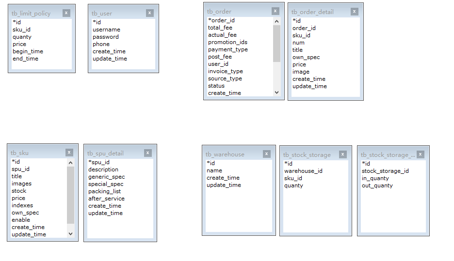

# 三、秒杀环境搭建（了解）

## 3.1. 安装redis及配置

### 3.1.1. 安装redis

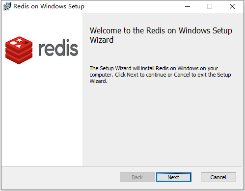

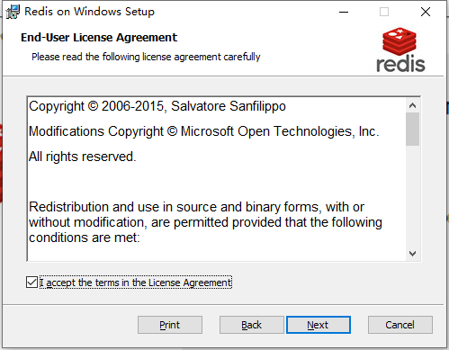

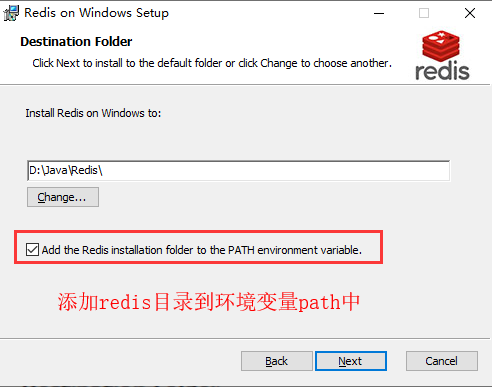

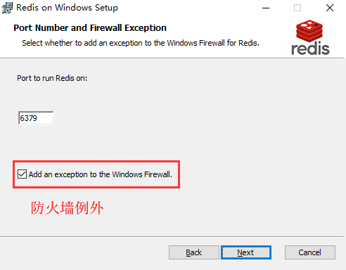

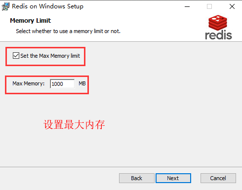


### 3.1.2. 配置redis

安装完毕后，需要先做一些设定工作，以便服务启动后能正常运行。使用文本编辑器，这里使用Notepad++，打开Redis服务配置文件。**注意：不要找错了，通常为redis.windows-service.conf，而不是redis.windows.conf**。后者是以非系统服务方式启动程序使用的配置文件。

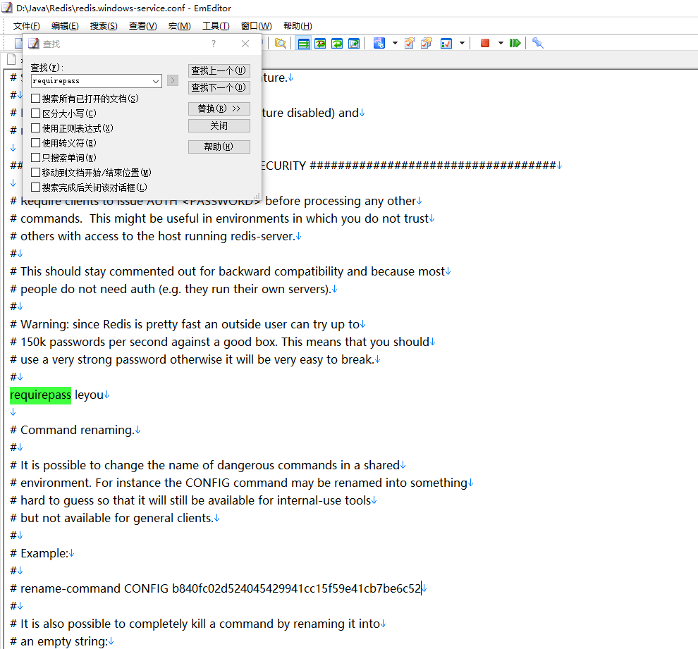

找到含有requirepass字样的地方，追加一行，输入requirepass leyou。这是访问Redis时所需的密码，后面在项目中也需要设置。

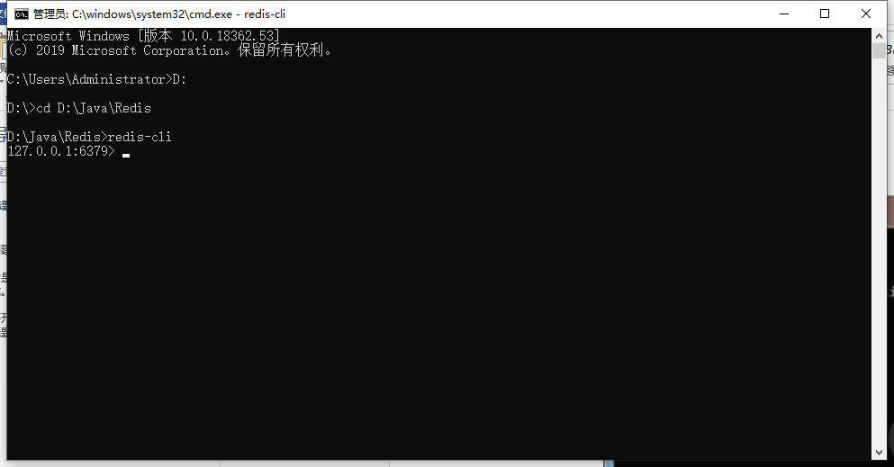

测试一下Redis是否正常提供服务。进入Redis的目录，cd C:\Program Files\Redis。输入redis-cli并回车。（redis-cli是客户端程序）如图正常提示进入，并显示正确端口号，则表示服务已经启动。

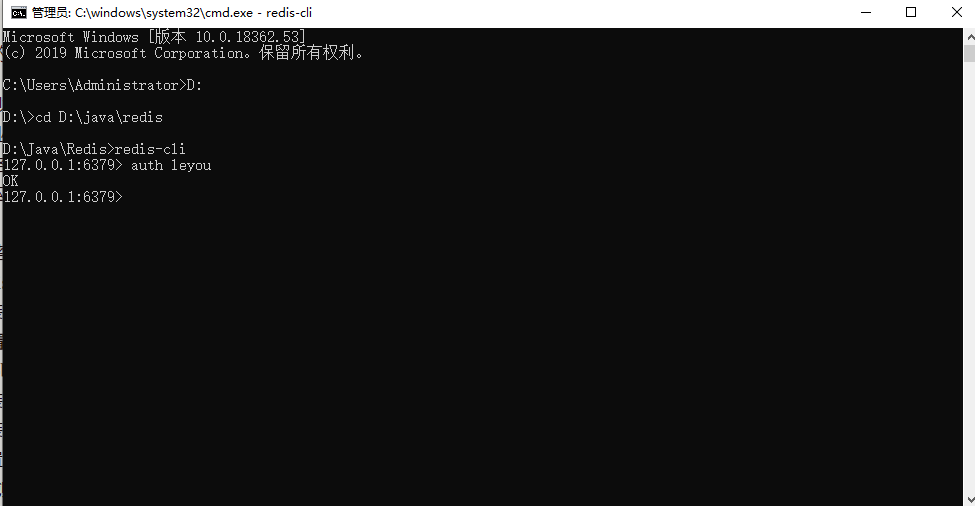

输入 auth leyou，显示OK，则密码正确。

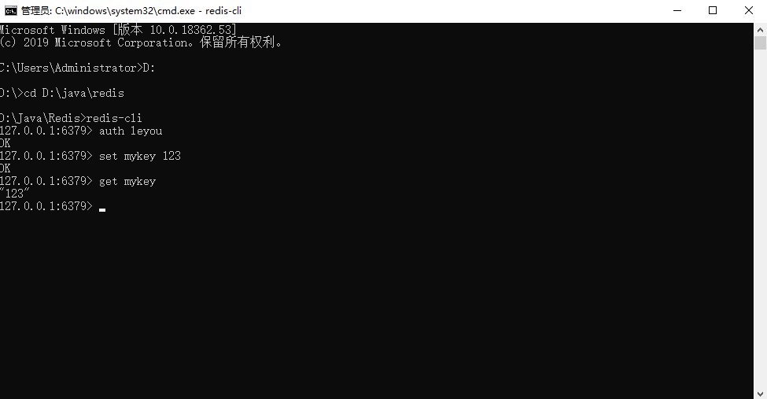

实际测试一下读写。输入set mykey "abd”并回车，用来保存一个键值。再输入get mykey，获取刚才保存的键值。


开启持久化，appendonly yes –默认为no。

持久化：将数据（如内存中的对象）保存到可永久保存的存储设备中。持久化的主要应用是将内存中的对象存储在数据库中，或者存储在磁盘文件中、 XML 数据文件中等等。

redis的数据都是缓存在内存中，当你重启系统或者关闭系统后，缓存在内存中的数据都会全部消失，再也找不回来了。所以为了让数据能够长期保存，就要将 Redis 放在缓存中的数据做持久化存储。

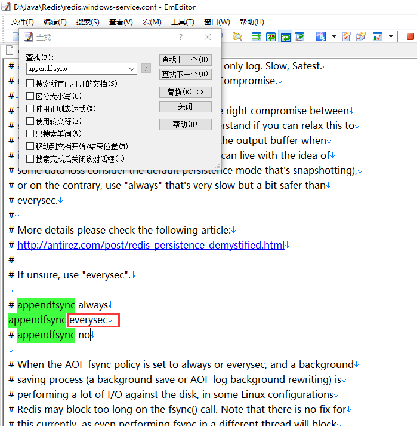

写入时机默认为everysec，每秒

也可以设置为always，实时写入，但是会有效率问题。

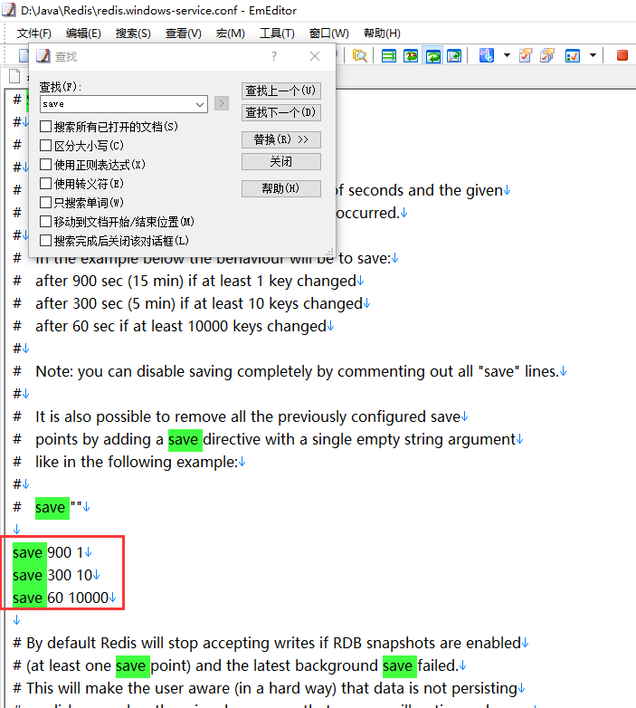

900秒有一个值存入，就持久化一次

300秒有10个值存入，就持久化一次

60秒有10000个值存入，就持久化一次

## 3.2. 安装RabbitMQ及配置

### 3.2.1. 安装RabbitMQ客户端

安装 otp_win64_20.2.exe

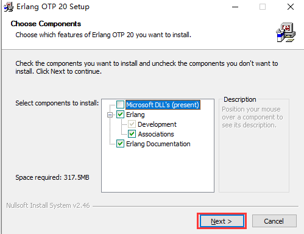

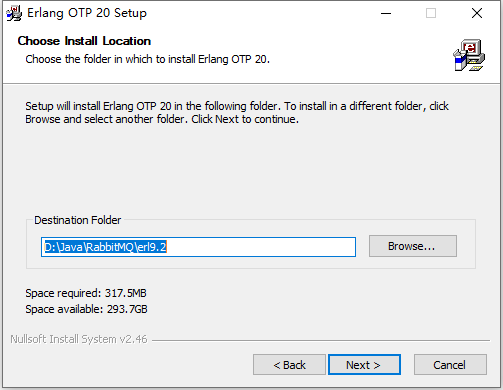

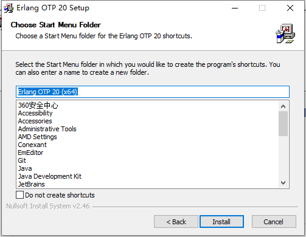

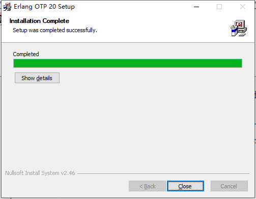

### 3.2.2. 安装RabbitMQ服务端

安装 rabbitmq-server-3.7.4.exe

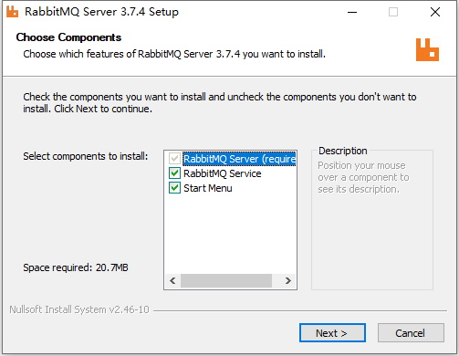

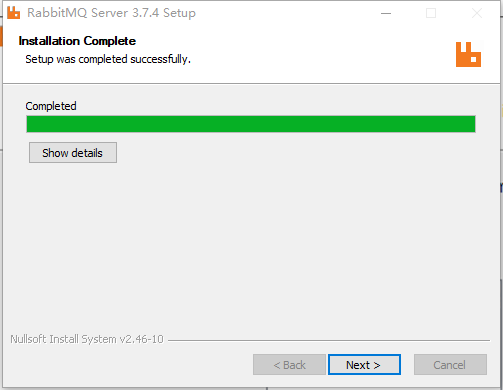

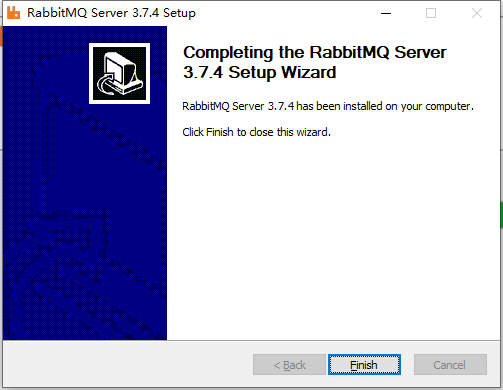

### 3.2.3. 配置RabbitMQ服务端


配置RabbitMQ客户端环境变量

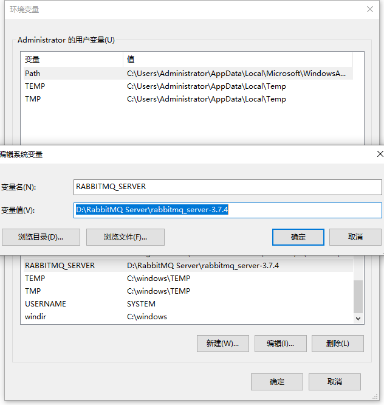

配置RabbitMQ服务端环境变量

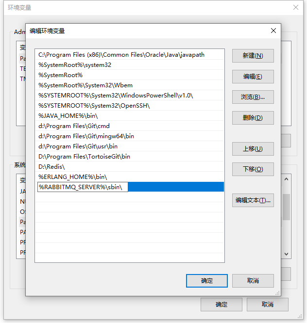

在环境变量中增加RabbitMQ服务端

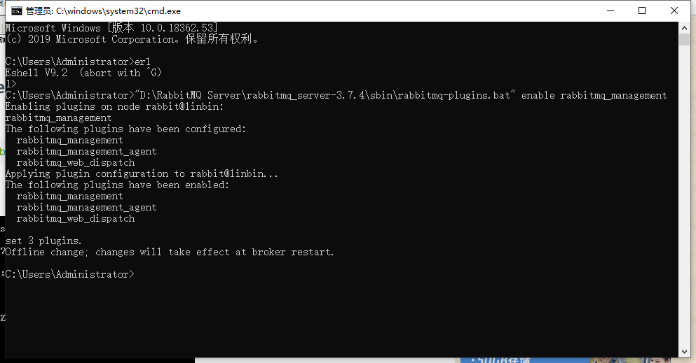

安装插件：rabbitmq-plugins.bat enable rabbitmq_management

重启RabbitMQ服务

启动RabbitMQ

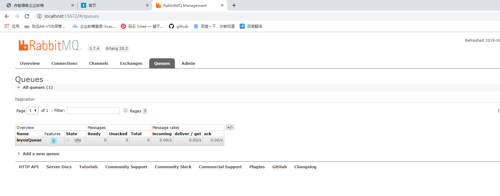

# 四、秒杀系统创建

首先看一下秒杀的目录结构


## 4.1. 创建Eureka注册中心（端口号9000）

------

第一步：选择File-New-Module...，弹出的窗口中选择Spring initializr，选择Module SDK，选择Next

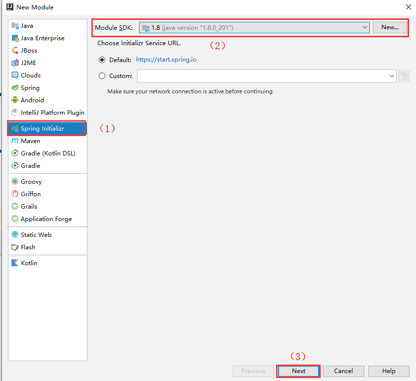

第二步：Group为com.itheima，Artifact为leyou，Name为leyouServer，Description为Server For leyou Project，选择Next

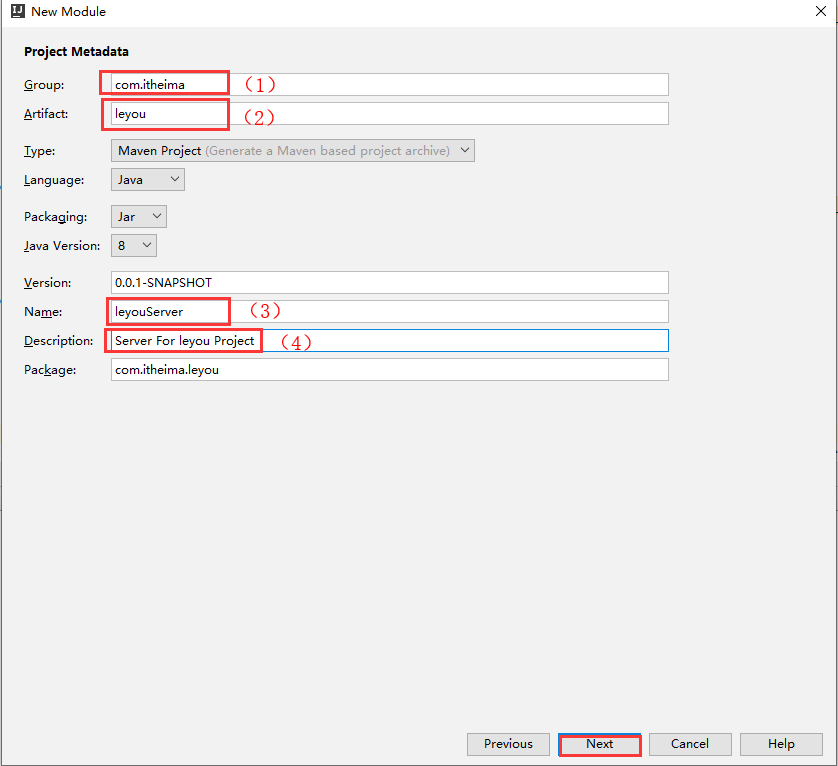

第三步：选择 Spring Cloud Discovery，选择 Eureka Server，选择Next


第四步：Module name 为 leyouServer，Content root为路径+leyouServer，选择Finish，此时在项目文件夹下会创建一个 leyouServer文件夹

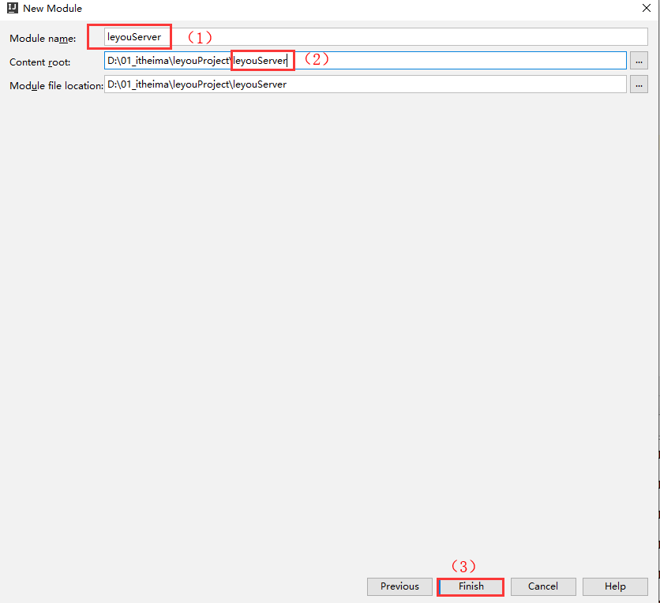

### 4.1.1. 配置pom.xml

在生成的项目中，打开pom.xml，配置依赖

```xml
<?xml version="1.0" encoding="UTF-8"?>
<project xmlns="http://maven.apache.org/POM/4.0.0"
         xmlns:xsi="http://www.w3.org/2001/XMLSchema-instance"
         xsi:schemaLocation="http://maven.apache.org/POM/4.0.0 http://maven.apache.org/xsd/maven-4.0.0.xsd">
    <modelVersion>4.0.0</modelVersion>

    <parent>
        <groupId>org.springframework.boot</groupId>
        <artifactId>spring-boot-parent</artifactId>
        <version>2.1.6.RELEASE</version>
    </parent>

    <groupId>com.itheima</groupId>
    <artifactId>leyou</artifactId>
    <version>1.0-SNAPSHOT</version>

    <dependencies>
        <dependency>
            <groupId>org.springframework.cloud</groupId>
            <artifactId>spring-cloud-starter-netflix-eureka-server</artifactId>
        </dependency>
    </dependencies>

    <dependencyManagement>
        <dependencies>
            <dependency>
                <groupId>org.springframework.cloud</groupId>
                <artifactId>spring-cloud-dependencies</artifactId>
                <version>Greenwich.SR2</version>
                <type>pom</type>
                <scope>import</scope>
            </dependency>
        </dependencies>
    </dependencyManagement>
</project>
```


在右下角悬浮的窗口中点击 Import Changes，会自动到Maven远程仓库去下载所需要用到的jar包。

如果没有引入，可以根据下图，在IDEA右侧选择 Maven Projects，找到leyouServer选择 Dependencies右击，选择 Download Sources，也会去Maven远程仓库下载所需要用到的jar包，后面的所有项目都如此。


### 4.1.2. 配置文件application.properties

在生成的项目中，打开src\man\resources\application.properties，配置端口号等

```properties
server.port=9000
eureka.client.service-url.defaultZone=http://localhost:9000/eureka/
eureka.instance.hostname=localhost
spring.application.name=leyou-server
#不从服务器拿服务信息
eureka.client.fetch-registry=false
#不在服务端注册
eureka.client.register-with-eureka=false
```

**注意：这里的端口号后一定不能加入空格等字符，否则会报错**

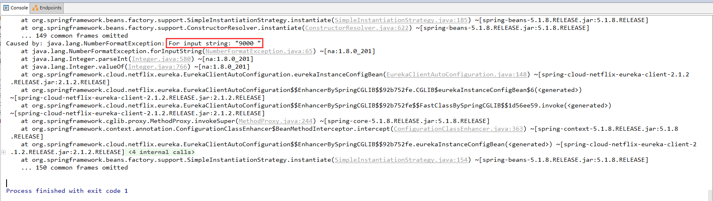

### 4.1.3. 编写启动类

在生成的项目中，打开src\main\java\com.itheima.leyou\leyouServerApplication，在已经生成的启动类中加入 @EnableEurekaServer，意思为启动Eureka服务端

```java
@SpringBootApplication
@EnableEurekaServer
public class ServerApplication {

   public static void main(String[] args) {
      SpringApplication.run(ServerApplication.class, args);
   }

}
```

测试运行注册中心，在浏览器中输入 http://localhost:9000

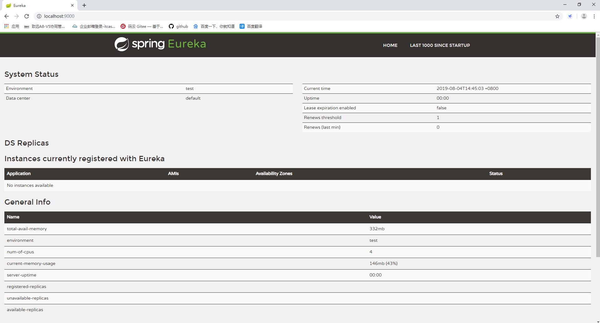

到这里，注册中心服务完成。


## 4.2. 创建时间服务（端口号8000）

------

### 4.2.1. 创建时间服务

第一步：选择File-New-Module...，弹出的窗口中选择Spring initializr，选择Module SDK，选择Next

第二步：Group为com.itheima，Artifact为leyou，Name为leyouTimeServer，Description为TimeServer For leyou Project，选择Next

第三步：选择 Spring Cloud Discovery，选择 Eureka Discovery Client，选择Next

第四步：Module name 为 leyouTimeServer，Content root为路径+leyouTimeServer，选择Finish，此时在项目文件夹下会创建一个 leyouTimeServer文件夹

在生成的项目中，打开pom.xml，配置依赖，其中spring-cloud-starter-netflix-eureka-client为项目引入了Eureka客户端的jar包，spring-boot-starter-web引入了web场景下，web模块开发所用到的jar包

```xml
<?xml version="1.0" encoding="UTF-8"?>
<project xmlns="http://maven.apache.org/POM/4.0.0"
         xmlns:xsi="http://www.w3.org/2001/XMLSchema-instance"
         xsi:schemaLocation="http://maven.apache.org/POM/4.0.0 http://maven.apache.org/xsd/maven-4.0.0.xsd">
    <modelVersion>4.0.0</modelVersion>

    <parent>
        <groupId>org.springframework.boot</groupId>
        <artifactId>spring-boot-parent</artifactId>
        <version>2.1.6.RELEASE</version>
    </parent>

    <groupId>com.itheima</groupId>
    <artifactId>leyou</artifactId>
    <version>1.0-SNAPSHOT</version>
    <name>leyouTimeServer</name>

    <dependencies>
        <dependency>
            <groupId>org.springframework.cloud</groupId>
            <artifactId>spring-cloud-starter-netflix-eureka-client</artifactId>
        </dependency>

        <dependency>
            <groupId>org.springframework.boot</groupId>
            <artifactId>spring-boot-starter-web</artifactId>
        </dependency>
    </dependencies>

    <dependencyManagement>
        <dependencies>
            <dependency>
                <groupId>org.springframework.cloud</groupId>
                <artifactId>spring-cloud-dependencies</artifactId>
                <version>Greenwich.SR2</version>
                <type>pom</type>
                <scope>import</scope>
            </dependency>
        </dependencies>
    </dependencyManagement>
    
</project>
```

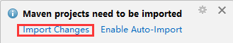

在生成的项目中，打开src\man\resources\application.properties，配置端口号等

```properties
server.port=8000
spring.application.name=leyou-time-server
eureka.client.service-url.defaultZone=http://localhost:9000/eureka/

```

在生成的项目中，打开src\main\java\com.itheima.leyou\leyouTimeServerApplication，在已经生成的启动类中加入 @EnableEurekaClient，意思为启动Eureka客户端

```java
@SpringBootApplication
@EnableEurekaClient
public class TimeServerApplication {

   public static void main(String[] args) {
      SpringApplication.run(TimeServerApplication.class, args);
   }

}

```

测试运行订单服务，在Eureka注册中心中可以看到 leyou-time-server服务，证明服务启动成功

### 4.2.2. 创建controller文件夹，并创建timeController.java文件

给TimeController.java类增加注解

```java
@RestController
public class timeController {}

```

### 4.2.3. 创建时间查询方法（getTime）

用途：给前端秒杀提供统一的时间标准，在TimeController里写入如下代码：

```java
@RequestMapping(value = "/getTime")
public String getTime(){
    SimpleDateFormat simpleDateFormat = new SimpleDateFormat("yyyy-MM-dd HH:mm:ss");
    return simpleDateFormat.format(new Date());
}
```

### 4.2.4. 测试时间查询

直接通过页面访问 getTime 方法，然后得到当前时间，地址：<http://localhost:8000/getTime>

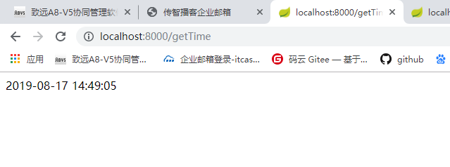


## 4.3. 创建商品服务（端口号7000）

------

### 4.3.1. 创建商品表结构（略）

### 4.3.2. 创建商品服务

第一步：选择File-New-Module...，弹出的窗口中选择Spring initializr，选择Module SDK，选择Next

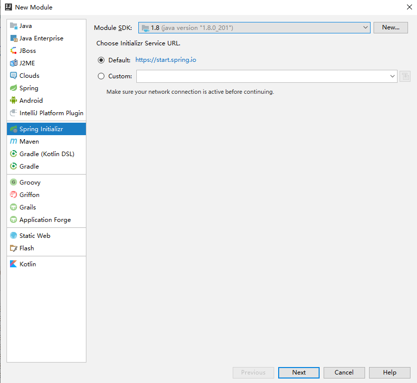

第二步：Group为com.itheima，Artifact为leyou，Name为leyouStock，Description为Stock For leyou Project，选择Next

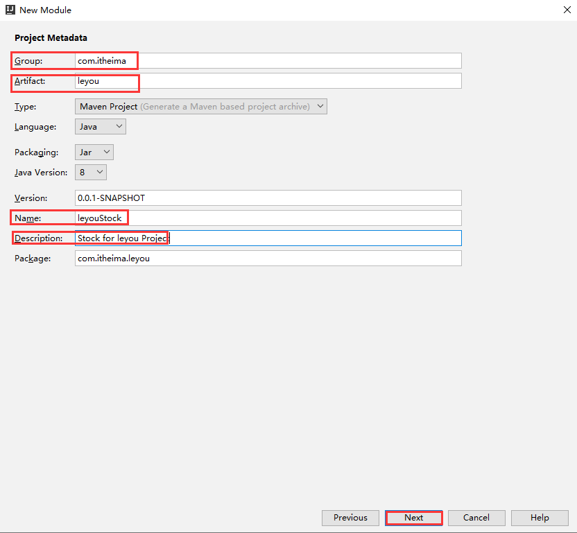

第三步：选择 Spring Cloud Discovery，选择 Eureka Discovery Client，选择Next

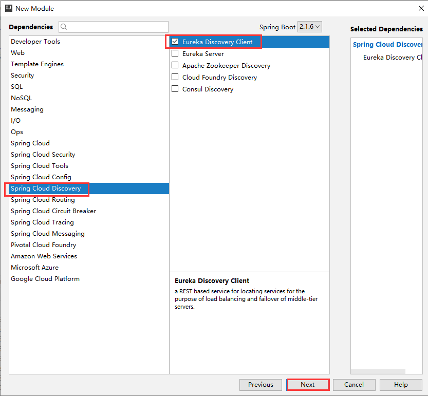

第四步：Module name 为 leyouStock，Content root为路径+leyouStock，选择Finish，此时在项目文件夹下会创建一个 leyouStock文件夹

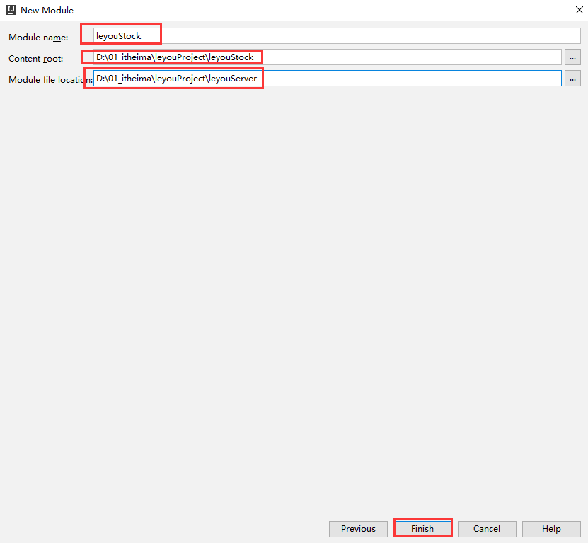

### 4.3.3. 配置pom.xml

在生成的项目中，打开pom.xml，配置依赖，其中spring-cloud-starter-netflix-eureka-client为项目引入了Eureka客户端的jar包，spring-boot-starter-web引入了web场景下，web模块开发所用到的jar包（**每个客户端必须要有这个依赖**），利用alibaba的fastjson解析json数据，所以引入alibaba.fastjson用到的jar包，mysql-connector-java与spring-boot-starter-data-jpa依赖引入mysql连接使用的jar包

```xml
<?xml version="1.0" encoding="UTF-8"?>
<project xmlns="http://maven.apache.org/POM/4.0.0"
         xmlns:xsi="http://www.w3.org/2001/XMLSchema-instance"
         xsi:schemaLocation="http://maven.apache.org/POM/4.0.0 http://maven.apache.org/xsd/maven-4.0.0.xsd">
    <modelVersion>4.0.0</modelVersion>

    <parent>
        <groupId>org.springframework.boot</groupId>
        <artifactId>spring-boot-parent</artifactId>
        <version>2.1.6.RELEASE</version>
    </parent>

    <groupId>com.itheima</groupId>
    <artifactId>leyou</artifactId>
    <version>1.0-SNAPSHOT</version>

    <name>leyouStock</name>

    <dependencies>
        <dependency>
            <groupId>org.springframework.cloud</groupId>
            <artifactId>spring-cloud-starter-netflix-eureka-client</artifactId>
        </dependency>

        <dependency>
            <groupId>org.springframework.boot</groupId>
            <artifactId>spring-boot-starter-web</artifactId>
        </dependency>

        <dependency>
            <groupId>mysql</groupId>
            <artifactId>mysql-connector-java</artifactId>
        </dependency>

        <dependency>
            <groupId>org.springframework.boot</groupId>
            <artifactId>spring-boot-starter-data-jpa</artifactId>
        </dependency>

        <dependency>
            <groupId>com.alibaba</groupId>
            <artifactId>fastjson</artifactId>
            <version>1.2.41</version>
        </dependency>

        <dependency>
            <groupId>org.springframework.boot</groupId>
            <artifactId>spring-boot-starter-data-redis</artifactId>
        </dependency>
    </dependencies>

    <dependencyManagement>
        <dependencies>
            <dependency>
                <groupId>org.springframework.cloud</groupId>
                <artifactId>spring-cloud-dependencies</artifactId>
                <version>Greenwich.SR2</version>
                <type>pom</type>
                <scope>import</scope>
            </dependency>
        </dependencies>
    </dependencyManagement>
</project>
```


### 4.3.4. 配置文件application.properties

在生成的项目中，打开src\man\resources\application.properties，配置端口号等

```properties
server.port=7000
spring.application.name=leyou-stock
eureka.client.service-url.defaultZone=http://localhost:9000/eureka/

spring.datasource.driver-class-name=com.mysql.cj.jdbc.Driver
spring.datasource.url=jdbc:mysql://localhost:3306/code1_2?useUnicode=true&characterEncoding=UTF-8&serverTimezone=UTC
spring.datasource.username=root
spring.datasource.password=root

#redis数据库编号，存在0~15共16个数据库
spring.redis.database=0
#redis服务器IP
spring.redis.host=127.0.0.1
#redis端口号
spring.redis.port=6379
#redis密码
spring.redis.password=leyou
#redis请求超时时间，超过此值redis自动断开连接
spring.redis.timeout=10000ms
#jedis最大连接数，超过此值则提示获取不到连接异常
spring.redis.jedis.pool.max-active=32
#jedis最大等待时间，超过此值会提示连接超时异常
spring.redis.jedis.pool.max-wait=10000ms
#jedis最大等待连接数
spring.redis.jedis.pool.max-idle=32
#jedis最小等待连接数
spring.redis.jedis.pool.min-idle=0
```

### 4.3.5. 编写启动类

在生成的项目中，打开src\main\java\com.itheima.leyou\leyouStockApplication，在已经生成的启动类中加入 @EnableEurekaClient，意思为启动Eureka客户端

```java
@SpringBootApplication
@EnableEurekaClient
public class StockApplication {

   public static void main(String[] args) {
      SpringApplication.run(StockApplication.class, args);
   }

}
```

注意：这里如果 @EnableEurekaClient报错，那就证明依赖文件引入有误，比如：在依赖spring-cloud-starter-netflix-eureka-client后加个1，如下图：


会导致：


**注意：一般会犯错的地方是 starter 写成 start，不容易看出来，可以到maven projects里去查看是否有错误**

测试运行商品服务，在Eureka注册中心中可以看到 leyou-Stock服务，证明服务启动成功

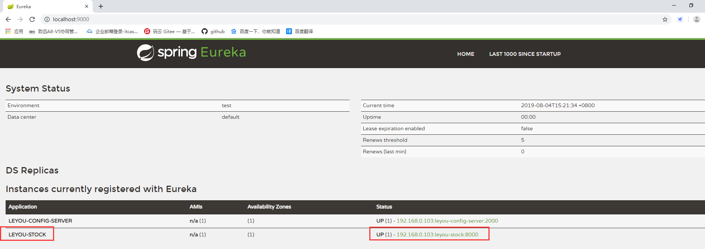

### 4.3.6. 创建controller\service\dao文件夹，并创建StockController.java\StockService.java\StockDao.java文件

Controller：管理业务（Service）调度和管理跳转

Service：管理具体功能、分支判断

Dao：管理数据交互，完成增删改查

Controller像是服务员，顾客点什么菜，在几号桌。

Service像是厨师，前端请求过来的菜单上的菜都是他做。

Dao像是厨房小工，原材料都是他来打交道。

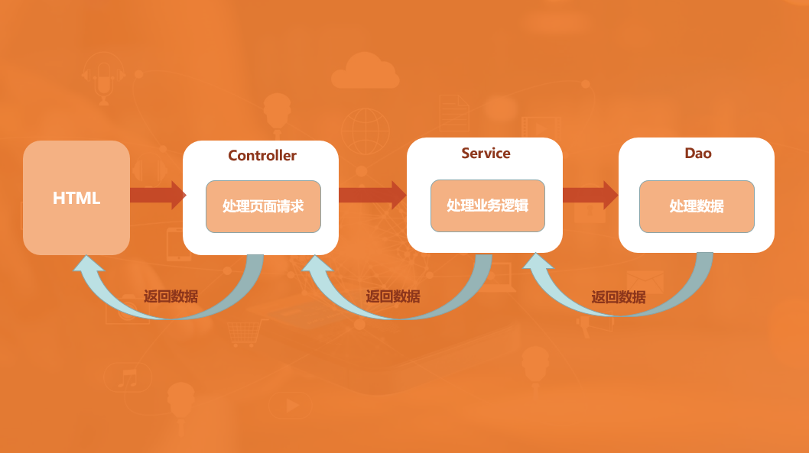

### 4.3.7. 创建商品列表查询方法（getStockList）

用途：为前端页面服务提供商品列表数据，主要用于前端商品列表页展示。


先约定好和前端交互返回的数据结构：

返回的json字符串：

如果返回值错误：{"result":"false", "msg":"****"}

如果返回值正确：{"result":"true", "msg":"", "sku_list":["id":1,"sku_id":...]}


先从Dao的方法开始编写代码：

创建Dao层接口文件，IStockDao

```java
public interface IStockDao {}
```

给StockDao.java类增加注解，@Repository用于标注数据访问组件，即DAO组件，实现IStockDao接口

```java
@Repository
public class StockDao implements IStockDao{}
```

声明 JDBCTemplate 方法，用于连接数据库使用

```java
@Autowired
private JdbcTemplate jdbcTemplate;
```

增加getStockList方法，首先从数据库中将商品列表所需要的数据查询出来，装入一个ArrayList变量中，原因是商品列表有多行数据，是一个列表，然后将ArrayList返回，代码如下：

```java
//1、创建一个SQL
String sql = "select id AS sku_id, title, images, stock, price, indexes, own_spec " +
        "from tb_sku";

//2、执行这个SQL
ArrayList<Map<String, Object>> list = (ArrayList<Map<String, Object>>) jdbcTemplate.queryForList(sql);

//3、返回数据
return list;
```

再编写Service

创建Service层接口文件，IStockService

```java
public interface IStockService {}
```

给StockService.java增加注解，并实现IStockService接口

```java
@Service
public class StockService implements IStockService{}
```

加入IStockDao接口的引用

```java
@Autowired
private IStockDao iStockDao;
```

增加getStockList方法，调用StockDao中的getStockList，返回一个Map

```java
public Map<String, Object> getStockList(){
        Map<String, Object> resultMap = new HashMap<String, Object>();
        //1、取IstockDao的方法
        ArrayList<Map<String, Object>> list = iStockDao.getStockList();

        //2、如果没取出数据，返回错误信息
        if (list==null||list.size()==0){
            resultMap.put("result", false);
            resultMap.put("msg", "我们也不知道为啥没取出数据！");
            return resultMap;
        }

        //3、从redis里取数据
        resultMap = getLimitPolicy(list);

        //4、返回正常信息
        resultMap.put("sku_list", list);
//        resultMap.put("result", true);
////        resultMap.put("msg", "");
        return resultMap;
    }
```

**注意：这里的Service有业务逻辑判断，当Dao返回数据后，如果数据为空，需要加入业务逻辑判断，未找到相应的商品信息，如果不加该判断，前端页面获取的数据为空，那么页面上会空白并且不显示任何数据，会给页面操作者带来不好的体验感，疑惑：是不是网络中断？或者服务器宕机？所以这里返回“未找到相应的商品信息”的提示，有助于页面友好的显示。前端的程序员也可以通过result参数判断**

通过alt+回车，选择Create method 'getStockList'，在IStockDao接口文件中自动创建接口的方法。

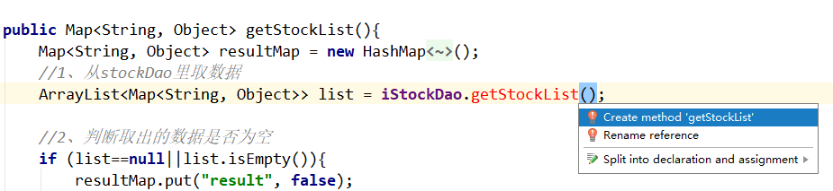

在IStockDao接口文件中给方法加上public修饰符，

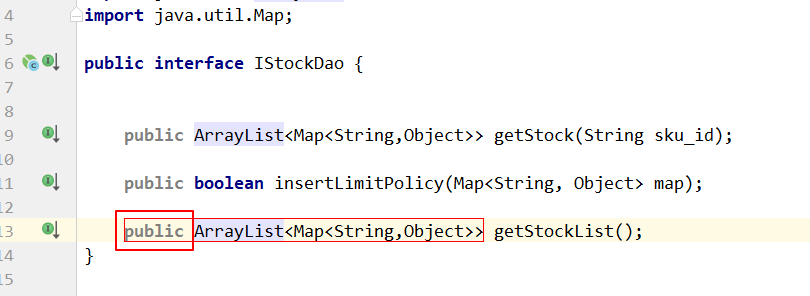

给StockController.java类增加注解

```java
@RestController
public class StockController {}
```

加入IStockService接口的引用

```java
@Autowired
private IStockService iStockService;
```

增加 getStockList 方法，调用StockService中的getStockList，返回的是一个Map，对于页面来说是得到一个Json字符串

```java
@RequestMapping(value = "/getStockList")
public Map<String, Object> getStockList(){
    return iStockService.getStockList();
}
```

测试getStockList方法，在浏览器中输入 http://localhost:7000/getStockList

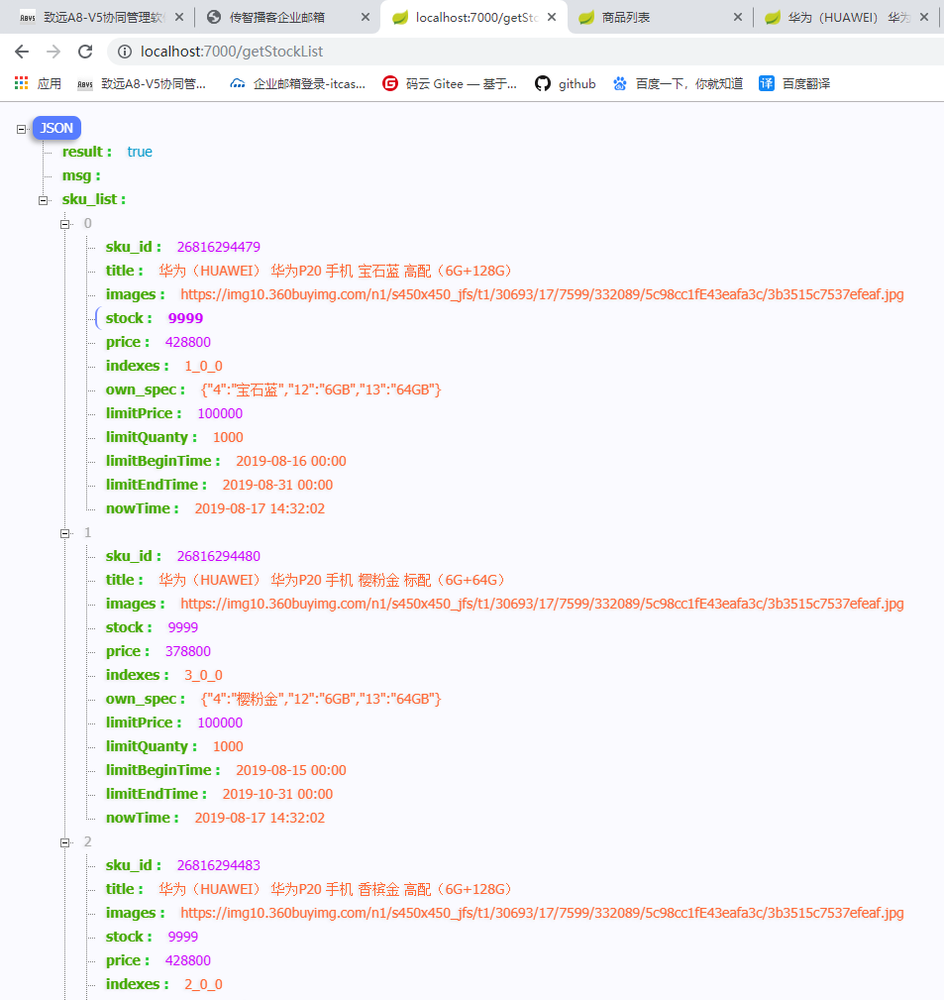

### 4.3.8. 创建商品查询方法（getStock）

用途：为前端页面服务提供商品详情页数据，主要用于前端商品详情页展示。

在StockDao.java类中增加 getStock方法，带一个sku_id参数，意思是通过sku_id进行查找，返回一个商品Map，代码如下：

```java
//1、创建一个SQL
String sql = "select tb_sku.spu_id, tb_sku.title, tb_sku.images, tb_sku.stock, tb_sku.price, tb_sku.indexes, " +
        "tb_sku.own_spec, tb_sku.enable, tb_sku.create_time, tb_sku.update_time,tb_spu_detail.description," +
        "tb_sku.id AS sku_id,tb_spu_detail.special_spec " +
        "from tb_sku " +
        "INNER JOIN tb_spu_detail ON tb_spu_detail.spu_id=tb_sku.spu_id " +
        "where tb_sku.id = ?";

//2、执行这个SQL
ArrayList<Map<String, Object>> list = (ArrayList<Map<String, Object>>) jdbcTemplate.queryForList(sql, sku_id);

//3、返回数据
return list;
```

在StockService.java类中增加getStock方法，返回一个商品Map，代码如下：

```java
public Map<String, Object> getStock(String sku_id){
        Map<String, Object> resultMap = new HashMap<String, Object>();

        //1、传入参数
        if (sku_id==null||sku_id.equals("")){
            resultMap.put("result", false);
            resultMap.put("msg", "前端传过来的什么东东？");
            return resultMap;
        }

        //2、取IstockDao的方法
        ArrayList<Map<String, Object>> list = iStockDao.getStock(sku_id);

        //3、如果没取出数据，返回错误信息
        if (list==null||list.size()==0){
            resultMap.put("result", false);
            resultMap.put("msg", "数据库咋回事，还取不出来数据了！");
            return resultMap;
        }

        //3、从redis里取数据
        resultMap = getLimitPolicy(list);

        //4、返回正常信息
        resultMap.put("sku", list);
//        resultMap.put("result", true);
//        resultMap.put("msg", "");
        return resultMap;
    }
```

**注意：这里的Service有业务逻辑判断，如果传入参数为空时，会导致数据库查询报错，因此在传入Dao层之前进行判断，传入的参数是否合法。当Dao返回数据后，如果数据为空，也需要加入业务逻辑判断，未找到相应的商品信息**

同时，在IStockDao中生成相对应的方法。

在StockController.java类中增加getStock方法，需要增加注解@RequestMapping，其中value = "/getStock/{sku_id}，返回一个商品Map，代码如下：

```java
@RequestMapping(value = "/getStock/{sku_id}")
public Map<String, Object> getStock(@PathVariable("sku_id") String sku_id){
    return iStockService.getStock(sku_id);
}
```

测试getStock方法，在浏览器中输入localhost:7000/getStock/123

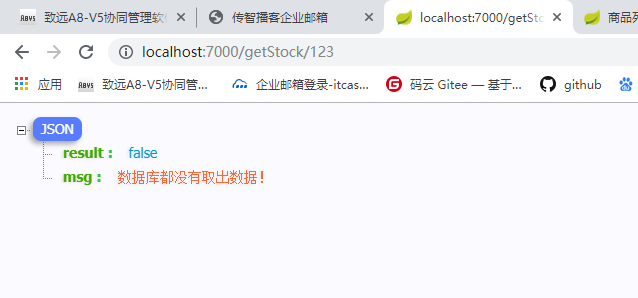

在浏览器中输入localhost:7000/getStock/26816294479

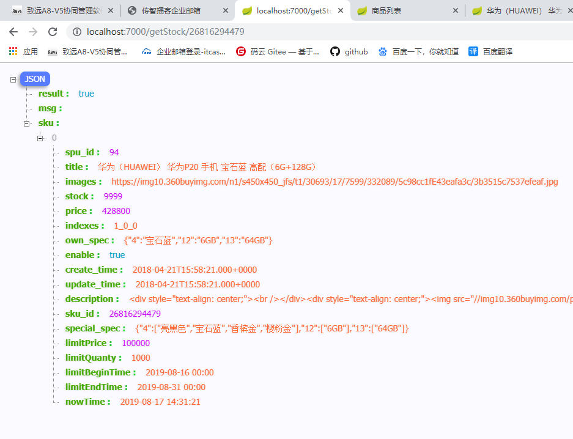

从redis里取值方法

```java
private Map<String, Object> getLimitPolicy(ArrayList<Map<String, Object>> list){
    Map<String, Object> resultMap = new HashMap<String, Object>();

    for (Map<String, Object> skuMap: list){
        //3.1、从redis取出政策
        String policy = stringRedisTemplate.opsForValue().get("LIMIT_POLICY_"+skuMap.get("sku_id").toString());

        //3.2、判断有政策的才继续
        if (policy!=null&&!policy.equals("")){
            Map<String, Object> policyInfo = JSONObject.parseObject(policy, Map.class);

            //3.3、开始时间小于等于当前时间，并且当前时间小于等于结束时间
            SimpleDateFormat simpleDateFormat = new SimpleDateFormat("yyyy-MM-dd HH:mm");
            String now = restTemplate.getForObject("http://leyou-time-server/getTime", String.class);
            try {
                Date end_time = simpleDateFormat.parse(policyInfo.get("end_time").toString());
                Date begin_time = simpleDateFormat.parse(policyInfo.get("begin_time").toString());
                Date now_time = simpleDateFormat.parse(now);

                if (begin_time.getTime()<=now_time.getTime()&&now_time.getTime()<=end_time.getTime()){
                    skuMap.put("limitPrice", policyInfo.get("price"));
                    skuMap.put("limitQuanty", policyInfo.get("quanty"));
                    skuMap.put("limitBeginTime", policyInfo.get("begin_time"));
                    skuMap.put("limitEndTime", policyInfo.get("end_time"));
                    skuMap.put("nowTime", now);
                }

            } catch (ParseException e) {
                e.printStackTrace();
            }
        }
    }

    resultMap.put("result", true);
    resultMap.put("msg", "");
    return resultMap;
}
```

### 4.3.9. 秒杀政策表结构

```sql
DROP TABLE IF EXISTS `tb_limit_policy`;
CREATE TABLE `tb_limit_policy` (
  `id` BIGINT(20) NOT NULL AUTO_INCREMENT COMMENT 'id',
  `sku_id` BIGINT(20) NOT NULL COMMENT 'skuid',
  `quanty` BIGINT(20) COMMENT '数量',
  `price` BIGINT(20) COMMENT '秒杀价格',
  `begin_time` TIMESTAMP COMMENT '开始时间',
  `end_time` TIMESTAMP COMMENT '结束时间',
  PRIMARY KEY (`id`)
) ENGINE=INNODB DEFAULT CHARSET=utf8;
```

### 4.3.10. 创建秒杀政策增加方法（insertLimitPolicy）

用途：用于创建秒杀政策，并将政策写入 Redis 缓存。

在StockDao.java中增加一个insertLimitPolicy方法，带一个map参数，map里是前端页面传入的信息，返回一个boolean值

```java
public boolean insertLimitPolicy(Map<String, Object> map){
    String sql = "insert into tb_limit_policy (sku_id, quanty, price, begin_time, end_time) " +
            "Values (?, ?, ?, ?, ?)";
    return jdbcTemplate.update(sql, map.get("sku_id"), map.get("quanty"), map.get("price"), map.get("begin_time"), map.get("end_time"))==1;
}
```

在StockService.java里增加一个insertLimitPolicy方法，返回一个map，代码如下：

```java
@Transactional
public Map<String, Object> insertLimitPolicy(Map<String, Object> policyMap){
        //1、判断传入的参数是不是合法
        Map<String, Object> resultMap = new HashMap<String, Object>();
        if (policyMap==null||policyMap.isEmpty()){
            resultMap.put("result", false);
            resultMap.put("msg", "传入什么东东");
            return resultMap;
        }

        //2、从StockDao接口中调用insertLimitPolicy方法
        boolean result = iStockDao.insertLimitPolicy(policyMap);

        //3、判断执行成功或失败，如果失败，返回错误信息
        if (!result){
            resultMap.put("result", false);
            resultMap.put("msg", "数据执行咋又失败了");
            return resultMap;
        }

        //4、如果成功，写入redis，需要写入有效期，key取名：LIMIT_POLICY_{sku_id}
        long diff = 0;
        String now = restTemplate.getForObject("http://leyou-time-server/getTime", String.class);

        SimpleDateFormat simpleDateFormat = new SimpleDateFormat("yyyy-MM-dd HH:mm");
        //结束日期减去当前日期得到政策的有效期
        try {
            Date end_time = simpleDateFormat.parse(policyMap.get("end_time").toString());
            Date now_time = simpleDateFormat.parse(now);
            diff = (end_time.getTime() - now_time.getTime())/1000;

            if (diff<0){
                resultMap.put("result", false);
                resultMap.put("msg", "结束时间不能小于当前时间");
                return resultMap;
            }
        } catch (ParseException e) {
            resultMap.put("result", false);
            resultMap.put("msg", "日期转换又失败了");
            return resultMap;
        }

        String policy = JSON.toJSONString(policyMap);
        stringRedisTemplate.opsForValue().set("LIMIT_POLICY_"+policyMap.get("sku_id").toString(), policy, diff, TimeUnit.SECONDS);
        ArrayList<Map<String, Object>> list = iStockDao.getStock(policyMap.get("sku_id").toString());
        String sku = JSON.toJSONString(list.get(0));
        stringRedisTemplate.opsForValue().set("SKU_"+policyMap.get("sku_id").toString(), sku, diff, TimeUnit.SECONDS);

        //5、返回正常信息
        resultMap.put("result", true);
        resultMap.put("msg", "");
        return resultMap;
    }
```

**注意：这里的Service有业务逻辑判断，首先判断传入的json是否可以转化成功，其次是写入数据库成功或者失败。**

**这里加入了一个@Transactional，是需要开启事务，需要记住只要是insert\delete\update这三个语句都需要开启事务，一旦写入数据库失败，可以回滚，由于上面涉及到的方法都是查询，所以不用开启事务**

在StockController里增加一个insertLimitPolicy方法，需要增加注解@RequestMapping，其中value = "/insertLimitPolicy/{jsonObj}，返回一个商品Map，代码如下：

```java
@RequestMapping(value = "/insertLimitPolicy/{jsonObj}")
public Map<String, Object> insertLimitPolicy(@PathVariable("jsonObj") String jsonObj){
    return iStockService.insertLimitPolicy(jsonObj);
}
```

测试insertLimitPolicy方法，在浏览器中输入[http://localhost:7000/insertLimitPolicy/{sku_id:'26816294479',quanty:1000,price:1000,begin_time:'2019-08-05 11:00',end_time:'2019-10-05 12:00'}](http://localhost:7000/insertLimitPolicy/%7Bsku_id:'26816294479',quanty:1000,price:1000,begin_time:'2019-08-05%2011:00',end_time:'2019-10-05%2012:00'%7D)

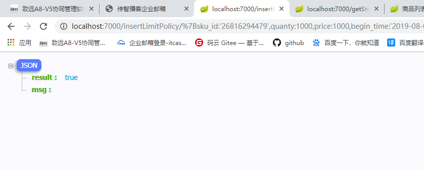

### 4.3.11. 在新增政策的时候存入redis

步骤：

1、配置redis依赖

2、配置文件application.properties增加redis配置

3、编写启动类增加restTemplate，需要调用时间服务

4、在Service时增加 RestTemplate 和 StringRedisTemplate 的变量声明

4、写入政策数据库表。

5、将政策写入Redis，key为 LIMIT_POLICY_{sku_id}。

6、结束时间到了，利用Redis的删除机制，自动删除，以减少内存占用。时间通过政策结束时间减去当前时间得到。

代码如下：

声明StringRestTemplate

```java
@Autowired
StringRedisTemplate stringRedisTemplate;
```

修改StockService里的insertLimitPolicy方法，增加以下代码


### 4.3.12. 封装商品列表和商品详情时取redis政策的方法（getLimitPolicy）

步骤：

1、循环商品列表

2、取出每个sku_id的政策

3、赋值给商品列表中

封装方法：getLimitPolicy

代码如下：

```java
private Map<String, Object> getLimitPolicy(ArrayList<Map<String, Object>> list){
    Map<String, Object> resultMap = new HashMap<String, Object>();

    for (Map<String, Object> skuMap: list){
        //3.1、从redis取出政策
        String policy = stringRedisTemplate.opsForValue().get("LIMIT_POLICY_"+skuMap.get("sku_id").toString());

        //3.2、判断有政策的才继续
        if (policy!=null&&!policy.equals("")){
            Map<String, Object> policyInfo = JSONObject.parseObject(policy, Map.class);

            //3.3、开始时间小于等于当前时间，并且当前时间小于等于结束时间
            SimpleDateFormat simpleDateFormat = new SimpleDateFormat("yyyy-MM-dd HH:mm");
            String now = restTemplate.getForObject("http://leyou-time-server/getTime", String.class);
            try {
                Date end_time = simpleDateFormat.parse(policyInfo.get("end_time").toString());
                Date begin_time = simpleDateFormat.parse(policyInfo.get("begin_time").toString());
                Date now_time = simpleDateFormat.parse(now);

                if (begin_time.getTime()<=now_time.getTime()&&now_time.getTime()<=end_time.getTime()){
                    skuMap.put("limitPrice", policyInfo.get("price"));
                    skuMap.put("limitQuanty", policyInfo.get("quanty"));
                    skuMap.put("limitBeginTime", policyInfo.get("begin_time"));
                    skuMap.put("limitEndTime", policyInfo.get("end_time"));
                    skuMap.put("nowTime", now);
                }

            } catch (ParseException e) {
                e.printStackTrace();
            }
        }
    }

    resultMap.put("result", true);
    resultMap.put("msg", "");
    return resultMap;
}
```

这里要注意：将政策写入列表里传给前端页面

limitPrice：政策上的价格

limitBeginTime：政策上开始时间

limitEndTime：政策上结束时间

nowTime：当前时间

## 4.4. 创建库存服务（端口号6001）

------

**注意：这里配置端口号不是6000，而是6001，原因是Chrome谷歌浏览器6000端口是访问不了的**

### 4.4.1. 创建库存表结构

1、库房表

```sql
DROP TABLE IF EXISTS `tb_warehouse`;
CREATE TABLE `tb_warehouse` (
  `id` BIGINT(20) NOT NULL AUTO_INCREMENT COMMENT '库房id',
  `name` VARCHAR(64) NOT NULL COMMENT '库房名称',
  `create_time` TIMESTAMP NULL DEFAULT CURRENT_TIMESTAMP COMMENT '创建时间',
  `update_time` TIMESTAMP NULL COMMENT '更新时间',
  PRIMARY KEY (`id`)
) ENGINE=INNODB DEFAULT CHARSET=utf8;
```

2、库存主表

用途：用于存储库存余量

```sql
DROP TABLE IF EXISTS `tb_stock_storage`;
CREATE TABLE `tb_stock_storage` (
  `id` BIGINT(20) NOT NULL AUTO_INCREMENT COMMENT 'id',
  `warehouse_id` BIGINT(20) NOT NULL COMMENT '库房id',
  `sku_id` BIGINT(20) NOT NULL COMMENT 'skuid',
  `quanty` DECIMAL(18,2) COMMENT '剩余数量',
  PRIMARY KEY (`id`)
) ENGINE=INNODB DEFAULT CHARSET=utf8;
```

3、库存历史表

用途：用于存储库存出入库明细历史

```sql
DROP TABLE IF EXISTS `tb_stock_storage_history`;
CREATE TABLE `tb_stock_storage_history` (
  `id` BIGINT(20) NOT NULL AUTO_INCREMENT COMMENT 'id',
  `stock_storage_id` BIGINT(20) NOT NULL COMMENT '库存主表id',
  `in_quanty` DECIMAL(18,2) COMMENT '入库数量',
  `out_quanty` DECIMAL(18,2) COMMENT '出库数量',
  PRIMARY KEY (`id`)
) ENGINE=INNODB DEFAULT CHARSET=utf8;
```

库存写入规则：

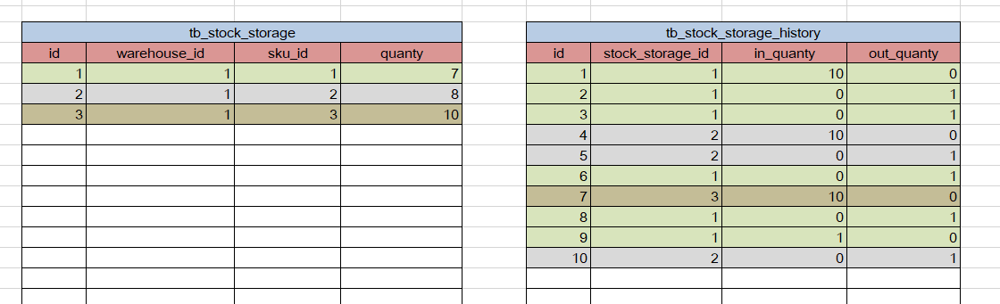

**注意：库存主表，一个库房一个商品只有一条记录，quanty存入的是剩余数量。**

**库存历史表，每一个库房的每一个商品对应一个库存主表ID，记录出入库的历史数量。**

写入规则说明：

1、通过sku_id判断库存主表是否有数据；

2、如果有数据，得到库存主表的id；

3、如果没有数据，则先写入库存主表，得到库存主表的id；

4、根据库存主表的id写入到历史表；

5、当库存主表有数据时，通过库存主表的id再次更新数量。

### 4.4.2. 创建库存服务

第一步：选择File-New-Module...，弹出的窗口中选择Spring initializr，选择Module SDK，选择Next


第二步：Group为com.itheima，Artifact为leyou，Name为leyouStorage，Description为Storage For leyou Project，选择Next

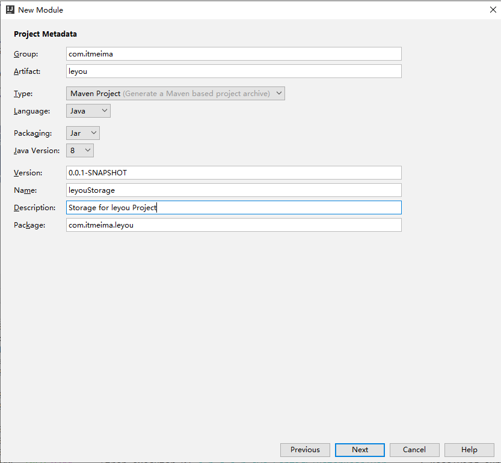

第三步：选择 Spring Cloud Discovery，选择 Eureka Discovery Client，选择Next


第四步：Module name 为 leyouStorage，Content root为路径+leyouStorage，选择Finish，此时在项目文件夹下会创建一个 leyouStorage文件夹

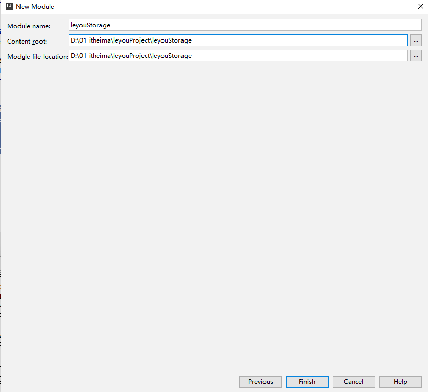

### 4.4.3. 配置pom.xml

在生成的项目中，打开pom.xml，配置依赖，其中spring-cloud-starter-netflix-eureka-client为项目引入了Eureka客户端的jar包，spring-boot-starter-web引入了web场景下，web模块开发所用到的jar包，利用alibaba的fastjson解析json数据，所以引入alibaba.fastjson用到的jar包，mysql-connector-java与spring-boot-starter-data-jpa依赖引入mysql连接使用的jar包

```xml
<?xml version="1.0" encoding="UTF-8"?>
<project xmlns="http://maven.apache.org/POM/4.0.0"
         xmlns:xsi="http://www.w3.org/2001/XMLSchema-instance"
         xsi:schemaLocation="http://maven.apache.org/POM/4.0.0 http://maven.apache.org/xsd/maven-4.0.0.xsd">
    <modelVersion>4.0.0</modelVersion>

    <parent>
        <groupId>org.springframework.boot</groupId>
        <artifactId>spring-boot-parent</artifactId>
        <version>2.1.6.RELEASE</version>
    </parent>

    <groupId>com.itheima</groupId>
    <artifactId>leyou</artifactId>
    <version>1.0-SNAPSHOT</version>

    <name>leyouStorage</name>

    <dependencies>
        <dependency>
            <groupId>org.springframework.cloud</groupId>
            <artifactId>spring-cloud-starter-netflix-eureka-client</artifactId>
        </dependency>

        <dependency>
            <groupId>org.springframework.boot</groupId>
            <artifactId>spring-boot-starter-web</artifactId>
        </dependency>

        <dependency>
            <groupId>mysql</groupId>
            <artifactId>mysql-connector-java</artifactId>
        </dependency>

        <dependency>
            <groupId>org.springframework.boot</groupId>
            <artifactId>spring-boot-starter-data-jpa</artifactId>
        </dependency>

        <dependency>
            <groupId>com.alibaba</groupId>
            <artifactId>fastjson</artifactId>
            <version>1.2.41</version>
        </dependency>

        <dependency>
            <groupId>org.springframework.boot</groupId>
            <artifactId>spring-boot-starter-data-redis</artifactId>
        </dependency>

        <dependency>
            <groupId>org.springframework.boot</groupId>
            <artifactId>spring-boot-starter-amqp</artifactId>
        </dependency>
    </dependencies>

    <dependencyManagement>
        <dependencies>
            <dependency>
                <groupId>org.springframework.cloud</groupId>
                <artifactId>spring-cloud-dependencies</artifactId>
                <version>Greenwich.SR2</version>
                <type>pom</type>
                <scope>import</scope>
            </dependency>
        </dependencies>
    </dependencyManagement>
    
</project>
```


### 4.4.4. 配置文件application.properties

在生成的项目中，打开src\man\resources\application.properties，配置端口号等

```properties
server.port=6001
spring.application.name=leyou-storage
eureka.client.service-url.defaultZone=http://localhost:9000/eureka/

spring.datasource.driver-class-name=com.mysql.cj.jdbc.Driver
spring.datasource.url=jdbc:mysql://localhost:3306/code1_2?useUnicode=true&characterEncoding=UTF-8&serverTimezone=UTC
spring.datasource.username=root
spring.datasource.password=root
```

在生成的项目中，打开src\main\java\com.itheima.leyou\leyouStorageApplication，在已经生成的启动类中加入 @EnableEurekaClient，意思为启动Eureka客户端

```java
@SpringBootApplication
@EnableEurekaClient
public class StorageApplication {

   public static void main(String[] args) {
      SpringApplication.run(StorageApplication.class, args);
   }

}
```

测试运行库存服务，在Eureka注册中心中可以看到 leyou-Storage服务，证明服务启动成功

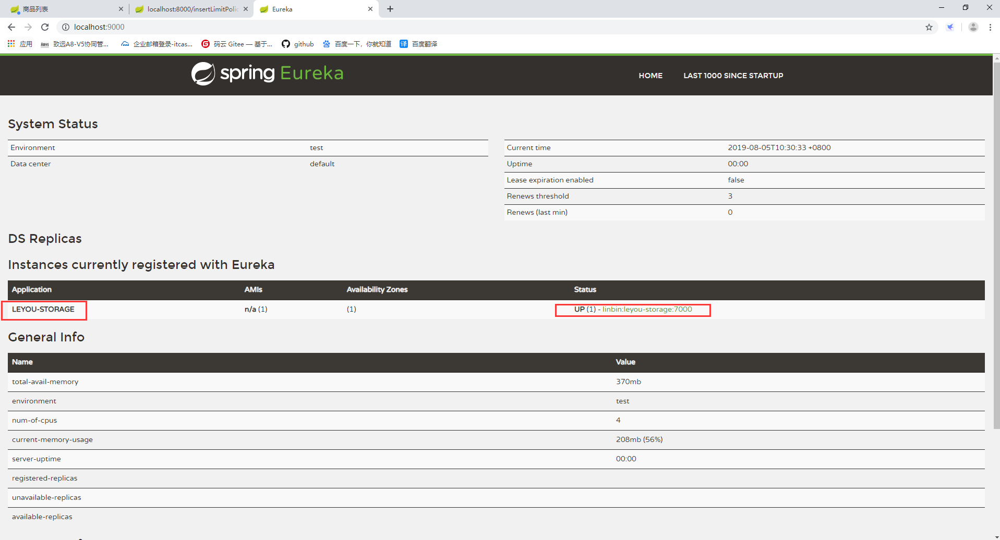

### 4.4.5. 创建controller\service\dao文件夹，并创建StorageController.java\StorageService.java\StorageDao.java文件

创建Dao层接口文件，IStorageDao

```java
public interface IStorageDao {}
```

给StorageDao.java类增加注解，@Repository用于标注数据访问组件，即DAO组件，实现IStroageDao接口

```java
@Repository
public class StorageDao implements IStorageDao{}
```

声明 JDBCTemplate 方法，用于连接数据库使用

```java
@Autowired
private JdbcTemplate jdbcTemplate;
```

创建Service层接口文件，IStorageService

给StorageService.java类增加注解，实现IStorageService的接口

```java
@Service
public class StorageService implements IStorageService {}
```

加入IStorageDao接口的引用

```java
@Autowired
private IStorageDao iStorageDao;
```

给StorageController.java类增加注解

```java
@RestController
@Configuration
public class StorageController {}
```

加入IStorageService接口的引用

```java
@Autowired
private IStorageService iStorageService;
```


### 4.4.6. 创建查询库存方法（getStockStorage）

用途：查询实际库存是否扣减或增加

在StorageDao.java类中增加 getStockStorage方法，带一个sku_id参数，意思是通过sku_id进行查找，返回一个商品list，代码如下：

```java
public ArrayList<Map<String, Object>> getStockStorage(String sku_id){
    //1、SQL取值
    String sql = "SELECT sku_id, quanty FROM tb_stock_storage WHERE sku_id = ?";

    //2、返回数据
    return (ArrayList<Map<String,Object>>) jdbcTemplate.queryForList(sql, sku_id);
}
```

在StorageService.java类中增加getStockStorage方法，返回一个商品Map，代码如下：

```java
public Map<String, Object> getStockStorage(String sku_id){
    //1、先取得一个商品的库存
    ArrayList<Map<String ,Object>> list = new ArrayList<Map<String, Object>>();
    list = iStorageDao.getStockStorage(sku_id);

    //2、判断如果stockDao取出的商品为空，返回一个提示
    Map<String, Object> resultMap = new HashMap<String, Object>();
    if (list==null||list.isEmpty()){
        resultMap.put("result", false);
        resultMap.put("msg", "完了，服务器挂了，数据没取出来！");
        return resultMap;
    }

    //3、判断如果取出的商品不为空，返回数据
    resultMap.put("storage", list);
    resultMap.put("result", true);
    resultMap.put("msg", "");
    return resultMap;
}
```

在StorageController.java类中增加getStockStorage方法，需要增加注解@RequestMapping，其中value = "/getStockStorage/{sku_id}，返回一个商品Map，代码如下：

```java
@RequestMapping(value = "/getStockStorage/{sku_id}")
public Map<String, Object> getStockStorage(@PathVariable("sku_id") String sku_id){
    return iStorageService.getStockStorage(sku_id);
}
```

### 4.4.7. 创建增减库存方法（insertStorage）

用途：监听队列时，获取消息，扣减库存

首先要了解库存的表结构：库存主表、库存历史表。库存主表保存的是库存商品现有的剩余数量，库存历史表是保存库存商品出入库的历史。

例如：A商品库存在a库房里还剩10个，则主表里是a库房，A商品，10个数量

进货20个，买出10个，则在历史表里有两条记录，一条是入20个，一条是出10个，汇总起来的数量正好等于库存主表的剩余数量

```
有人会问了：那查库存数量直接汇总历史表不就可以了？
答案是否，例如京东的销售一件商品会有10万+，那么历史表里有10万+数据，汇总就会很耗时，直接通过主表就可以很轻松的拿到库存剩余数量。
```

在StorageDao.java类中增加 insertStorage方法，带三个sku_id，inquanty，outquanty参数，意思是写入哪个库房的哪个商品多少个，返回map，**注意：这里库房是虚拟一个id是1的库房，所以写入的时候直接把warehouse_id赋值为1。**

代码如下：

```java
public Map<String, Object> insertStorage(String sku_id, double in_quanty, double out_quanty){

    Map<String, Object> resultMap = new HashMap<String, Object>();

    //1、查询库存主表是否有库存
    String sql = "SELECT id FROM tb_stock_storage WHERE sku_id = ?";
    ArrayList<Map<String, Object>> list = (ArrayList<Map<String, Object>>) jdbcTemplate.queryForList(sql, sku_id);

    int new_id = 0;
    double thisQuanty = in_quanty - out_quanty;
    boolean result = false;

    //2、如果有库存，获取id，作用一写入历史表，作用二反回来更新
    if (list!=null&&list.size()>0){
        new_id = Integer.parseInt(list.get(0).get("id").toString());
    }else {
        //3、如果没有库存，写入主表库存，并且得到id，作用写入历史表
        sql = "INSERT INTO tb_stock_storage (warehouse_id, sku_id, quanty) VALUES (1, "+sku_id+", "+thisQuanty+")";
        KeyHolder keyHolder = new GeneratedKeyHolder();
        final String finalSql = sql;
        result = jdbcTemplate.update(new PreparedStatementCreator() {

            public PreparedStatement createPreparedStatement(Connection connection) throws SQLException {
                PreparedStatement preparedStatement = connection.prepareStatement(finalSql, Statement.RETURN_GENERATED_KEYS);
                return preparedStatement;
            }

        }, keyHolder)==1;

        //3.1、如果写入失败，返回错误信息 msg
        if (!result){
            resultMap.put("result", false);
            resultMap.put("msg", "写入库存主表失败了！");
            return resultMap;
        }

        new_id = keyHolder.getKey().intValue();
    }

    //4、写入历史表
    sql = "INSERT INTO tb_stock_storage_history (stock_storage_id, in_quanty, out_quanty) " +
            "VALUES (?, ?, ?)";
    result = jdbcTemplate.update(sql, new_id, in_quanty, out_quanty)==1;

    //4.1、如果写入失败，返回错误信息 msg
    if (!result){
        resultMap.put("result", false);
        resultMap.put("msg", "写入库存历史表失败了！");
        return resultMap;
    }

    //5、如果有库存，反回来更新主表
    if (list!=null&&list.size()>0){
        sql = "UPDATE tb_stock_storage SET quanty = quanty + ? " +
                "WHERE id = ? AND quanty + ? >= 0";
        result = jdbcTemplate.update(sql, thisQuanty, new_id, thisQuanty)==1;
        //5.1、如果写入失败，返回错误信息 msg
        if (!result){
            resultMap.put("result", false);
            resultMap.put("msg", "更新库存主表失败了！");
            return resultMap;
        }

    }

    //6、返回正常数据
    resultMap.put("result", true);
    resultMap.put("msg", "");
    return resultMap;
}
```

**首先检查这个商品是否有库存，就是主表是否有这个商品，如果有，证明以前这个商品有入库，所以对库存主表进行更新，如果没有，证明以前这个商品没有入库，所以要写入库存主表，原因是库存主表直接可以查询到库存余额，所以需要直接记录库存余额的数量。**

库存历史表用于记录出入的历史，直接写入即可。

代码逻辑分析：

- 根据库房+商品SKU在库存主表中查询是否有库存
- 如果没有，写入库存主表，并得到写入主表的id，这个id用来写入历史表
- 如果有，直接根据第一次的查询获取主表的id
- 利用获取到的库存主表id写入库存历史表
- 统一更新库存主表的数量

在StorageService.java类中增加insertStorage方法，返回一个商品Map，代码如下：

```java
@Transactional
public Map<String, Object> insertStorage(String sku_id, double in_quanty, double out_quanty){
    Map<String, Object> resultMap = new HashMap<String, Object>();

    //1、传入的参数
    if (sku_id.equals("")){
        resultMap.put("result", false);
        resultMap.put("msg", "商品的sku不能为空！");
        return resultMap;
    }

    if (in_quanty==0&&out_quanty==0){
        resultMap.put("result", false);
        resultMap.put("msg", "入库数量和出库数量不能同时为0！");
        return resultMap;
    }

    //2、调StorageDao的方法
    resultMap = iStorageDao.insertStorage(sku_id, in_quanty, out_quanty);

    //3、返回
    return resultMap;
}
```

**由于库存属于敏感数据，所以操作库存的时候一定要加以判断，在Service判断逻辑，Dao里判断数据库逻辑。**

在StorageController.java类中增加insertStorage方法，需要增加注解@RequestMapping，其中value = "/insertStorage/{warehouse_id}/{sku_id}/{inquanty}/{outquanty}"，返回一个商品Map，代码如下：

```java
@RequestMapping(value = "/insertStorage/{sku_id}/{inquanty}/{outquanty}")
public Map<String, Object> insertStorage(@PathVariable("sku_id") String sku_id,
                             @PathVariable("inquanty") double inquanty, @PathVariable("outquanty") double outquanty){
    return iStorageService.insertStorage(sku_id, inquanty, outquanty);
}
```

### 4.4.8. 测试库存增减

直接通过页面访问 getStorageQuanty 方法，查询现有数量，再用insertStorage 方法增减，最后通过 getStorageQuanty 方法再查询

查询库存的地址为：<http://localhost:6001/getStockStorage/26816294479>


先查询一下库存有990个

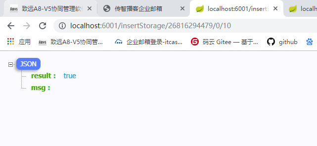

再通过insertStorage方法增减库存，这里展示减10个，

写入库存的地址为：<http://localhost:6001/insertStorage/26816294479/0/10>

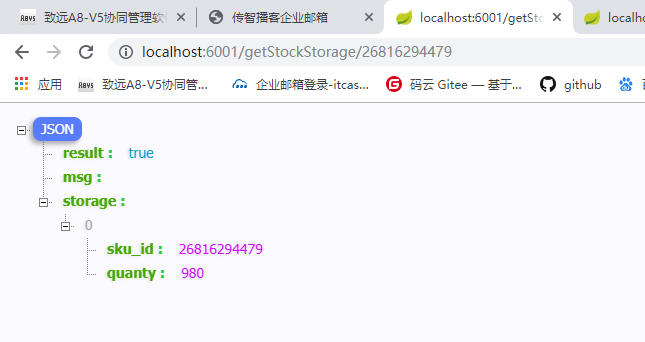

最后查询一次库存有980个，

查询库存的地址为：<http://localhost:6001/getStockStorage/26816294479>


### 4.4.9. 处理库存队列监听方法（storage_queue）

新增依赖

```xml
<dependency>
    <groupId>org.springframework.boot</groupId>
    <artifactId>spring-boot-starter-amqp</artifactId>
</dependency>
```

在src\main\java\com\itheima\leyou\文件夹下新建文件夹queue，在queue文件夹下新建java文件StorageQueue

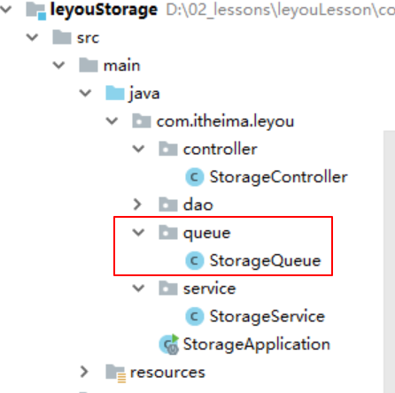

在StorageQueue.java里写入队列监听方法，调用iStorageService.insertStorage来写入库存，代码如下：

```java
@Component
public class StorageQueue {

    @Autowired
    private IStorageService iStorageService;

    @RabbitListener(queues = "storage_queue")
    public void getStorageQueue(String msg){
        System.out.println("storage_queue接收消息："+msg);

        Map<String, Object> result = new HashMap<String, Object>();
        try {
            result = iStorageService.insertStorage(msg, 0, 1);

            if (!(Boolean) result.get("result")){
                System.out.println("storage_queue消息处理失败："+result.get("msg"));
            }
        }catch (Exception e){
            System.out.println("storage_queue消息处理失败："+e.getMessage());
        }

        System.out.println("storage_queue消息处理完毕！"+result);
    }
}
```


## 4.5. 创建会员服务（端口号5000）

------

### 4.5.1. 创建会员表结构

```sql
DROP TABLE IF EXISTS `tb_user`;
CREATE TABLE `tb_user` (
  `id` BIGINT(20) NOT NULL AUTO_INCREMENT,
  `username` VARCHAR(32) NOT NULL COMMENT '用户名',
  `password` VARCHAR(60) NOT NULL COMMENT '密码，加密存储',
  `phone` VARCHAR(11) DEFAULT NULL COMMENT '注册手机号',
  `create_time` TIMESTAMP NULL DEFAULT CURRENT_TIMESTAMP COMMENT '创建时间',
  `update_time` TIMESTAMP NULL COMMENT '更新时间',
  PRIMARY KEY (`id`),
  UNIQUE KEY `username` (`username`) USING BTREE,
  UNIQUE KEY `phone` (`phone`)
) ENGINE=INNODB AUTO_INCREMENT=31 DEFAULT CHARSET=utf8 COMMENT='用户表';

```

### 4.5.2. 创建会员服务

第一步：选择File-New-Module...，弹出的窗口中选择Spring initializr，选择Module SDK，选择Next

第二步：Group为com.itheima，Artifact为leyou，Name为leyouUser，Description为User For leyou Project，选择Next

第三步：选择 Spring Cloud Discovery，选择 Eureka Discovery Client，选择Next

第四步：Module name 为 leyouUser，Content root为路径+leyouUser，选择Finish，此时在项目文件夹下会创建一个 leyouUser文件夹

### 4.5.3. 配置pom.xml

在生成的项目中，打开pom.xml，配置依赖，其中spring-cloud-starter-netflix-eureka-client为项目引入了Eureka客户端的jar包，spring-boot-starter-web引入了web场景下，web模块开发所用到的jar包，利用alibaba的fastjson解析json数据，所以引入alibaba.fastjson用到的jar包，mysql-connector-java与spring-boot-starter-data-jpa依赖引入mysql连接使用的jar包

```xml
<?xml version="1.0" encoding="UTF-8"?>
<project xmlns="http://maven.apache.org/POM/4.0.0"
         xmlns:xsi="http://www.w3.org/2001/XMLSchema-instance"
         xsi:schemaLocation="http://maven.apache.org/POM/4.0.0 http://maven.apache.org/xsd/maven-4.0.0.xsd">
    <modelVersion>4.0.0</modelVersion>

    <parent>
        <groupId>org.springframework.boot</groupId>
        <artifactId>spring-boot-parent</artifactId>
        <version>2.1.6.RELEASE</version>
    </parent>

    <groupId>com.itheima</groupId>
    <artifactId>leyou</artifactId>
    <version>1.0-SNAPSHOT</version>

    <name>leyouUser</name>

    <dependencies>
        <dependency>
            <groupId>org.springframework.cloud</groupId>
            <artifactId>spring-cloud-starter-netflix-eureka-client</artifactId>
        </dependency>

        <dependency>
            <groupId>org.springframework.boot</groupId>
            <artifactId>spring-boot-starter-web</artifactId>
        </dependency>

        <dependency>
            <groupId>mysql</groupId>
            <artifactId>mysql-connector-java</artifactId>
        </dependency>

        <dependency>
            <groupId>org.springframework.boot</groupId>
            <artifactId>spring-boot-starter-data-jpa</artifactId>
        </dependency>

        <dependency>
            <groupId>com.alibaba</groupId>
            <artifactId>fastjson</artifactId>
            <version>1.2.41</version>
        </dependency>

        <dependency>
            <groupId>org.springframework.boot</groupId>
            <artifactId>spring-boot-starter-data-redis</artifactId>
        </dependency>

        <dependency>
            <groupId>org.springframework.session</groupId>
            <artifactId>spring-session-data-redis</artifactId>
            <version>2.1.7.RELEASE</version>
        </dependency>

    </dependencies>

    <dependencyManagement>
        <dependencies>
            <dependency>
                <groupId>org.springframework.cloud</groupId>
                <artifactId>spring-cloud-dependencies</artifactId>
                <version>Greenwich.SR2</version>
                <type>pom</type>
                <scope>import</scope>
            </dependency>
        </dependencies>
    </dependencyManagement>
    
</project>
```


### 4.5.4. 配置文件application.properties

在生成的项目中，打开src\man\resources\application.properties，配置端口号等

```properties
server.port=5000
spring.application.name=leyou-user
eureka.client.service-url.defaultZone=http://localhost:9000/eureka/

spring.datasource.driver-class-name=com.mysql.cj.jdbc.Driver
spring.datasource.url=jdbc:mysql://localhost:3306/code1_2?useUnicode=true&characterEncoding=UTF-8&serverTimezone=UTC
spring.datasource.username=root
spring.datasource.password=root

#redis数据库编号，存在0~15共16个数据库
spring.redis.database=0
#redis服务器IP
spring.redis.host=127.0.0.1
#redis端口号
spring.redis.port=6379
#redis密码
spring.redis.password=leyou
#redis请求超时时间，超过此值redis自动断开连接
spring.redis.timeout=10000ms
#jedis最大连接数，超过此值则提示获取不到连接异常
spring.redis.jedis.pool.max-active=32
#jedis最大等待时间，超过此值会提示连接超时异常
spring.redis.jedis.pool.max-wait=10000ms
#jedis最大等待连接数
spring.redis.jedis.pool.max-idle=32
#jedis最小等待连接数
spring.redis.jedis.pool.min-idle=0
```

在生成的项目中，打开src\main\java\com.itheima.leyou\leyouUserApplication，在已经生成的启动类中加入 @EnableEurekaClient，意思为启动Eureka客户端

```java
@SpringBootApplication
@EnableEurekaClient
public class UserApplication {

   public static void main(String[] args) {
      SpringApplication.run(UserApplication.class, args);
   }
}

```

测试运行订单服务，在Eureka注册中心中可以看到 leyou-User服务，证明服务启动成功

### 4.5.5. 创建controller\service\dao文件夹，并创建UserController.java\UserService.java\UserDao.java文件

创建Dao层接口文件，IUserDao

```java
public interface IUserDao {}
```

给UserDao.java类增加注解，@Repository用于标注数据访问组件，即DAO组件，实现IUserDao的接口

```java
@Repository
public class UserDao implements IUserDao {}

```

声明 JDBCTemplate 方法，用于连接数据库使用

```java
@Autowired
private JdbcTemplate jdbcTemplate;
```

创建Service层接口，IUserService

给UserService.java类增加注解，实现IUserService接口

```java
@Service
public class UserService implements IUserService{}
```

加入UserDao的引用

```java
@Autowired
private IUserDao iUserDao;

```

给UserController.java类增加注解

```java
@RestController
public class UserController {}

```

加入UserService接口的引用

```java
@Autowired
private IUserService iUserService;

```

### 4.5.6. 创建查询会员方法（getUser）

用途：给前端提供会员信息数据，主要用于前端会员登录

在UserDao.java类中增加 getUser方法，带两个username，password参数，意思是通过username和password进行查找，返回一个会员List，代码如下：

```java
public ArrayList<Map<String, Object>> getUser(String username, String password){
    String sql = "select id AS user_id, username, phone, password from tb_user where username = ?";
    return (ArrayList<Map<String,Object>>) jdbcTemplate.queryForList(sql, username);
}
```

在UserService.java类中增加getUser方法，返回一个商品List，代码如下：

```java
public Map<String, Object> getUser(String username, String password){
    Map<String, Object> resultMap = new HashMap<String, Object>();
    //1、判断传入的参数是否有误
    if (username==null||username.equals("")){
        resultMap.put("result", false);
        resultMap.put("msg", "用户名不能为空！");
        return resultMap;
    }

    //2、取会员列表
    ArrayList<Map<String, Object>> list = iUserDao.getUser(username, password);
    if (list==null||list.isEmpty()){
        resultMap.put("result", false);
        resultMap.put("msg", "没找到会员信息！");
        return resultMap;
    }

    resultMap = list.get(0);
    resultMap.put("result", true);
    resultMap.put("msg", "");
    return resultMap;
}
```

### 4.5.7. 创建增加会员方法（insertUser）

用途：给前端提供会员信息增加，主要用于前端会员注册

在UserDao.java类中增加 insertUser方法，带username，phone，password三个参数，返回一个Map，代码如下：

```java
public int insertUser(String username, String password){
    final String sql = "insert into tb_user (username, phone, password) values ('"+username+"', '"+username+"', '"+password+"')";
    KeyHolder keyHolder = new GeneratedKeyHolder();
    jdbcTemplate.update(new PreparedStatementCreator() {
        public PreparedStatement createPreparedStatement(Connection connection) throws SQLException {
            PreparedStatement preparedStatement = connection.prepareStatement(sql, Statement.RETURN_GENERATED_KEYS);
            return preparedStatement;
        }
    }, keyHolder);

    return keyHolder.getKey().intValue();
}
```

代码分析：

- 根据手机号先查询是否存在该用户
- 如果存在则提示该用户已经存在
- 根据三个参数写入会员表中
- 写入正确则返回result为true，写入错误则返回result为false

在UserService.java类中增加insertUser方法，返回一个商品Map，代码如下：

```java
@Transactional
public Map<String, Object> insertUser(String username, String password){
    Map<String, Object> resultMap = new HashMap<String, Object>();
    //1、判断传入的参数是否有误
    if (username==null||username.equals("")){
        resultMap.put("result", false);
        resultMap.put("msg", "用户名不能为空！");
        return resultMap;
    }

    int user_id = iUserDao.insertUser(username, password);

    if (user_id<=0){
        resultMap.put("result", false);
        resultMap.put("msg", "数据库没有执行成功！");
        return resultMap;
    }

    resultMap.put("user_id", user_id);
    resultMap.put("username", username);
    resultMap.put("phone", username);
    resultMap.put("password", password);
    resultMap.put("result", true);
    resultMap.put("msg", "");
    return resultMap;
}
```

**注意：这里的Service有业务逻辑判断，如果Json转化错误或传入参数为空时，会导致数据库写入报错，因此在传入Dao层之前进行判断，传入的参数是否合法。解析出来的json也需要判断，用户名和电话不能为空**

### 4.5.8. 在UserController.java类中增加login方法

需要增加注解@RequestMapping，其中value = "/login，返回一个Map，代码如下：

```java
@RequestMapping(value = "/login", method = RequestMethod.POST)
public Map<String, Object> login(String username, String password, HttpServletRequest httpServletRequest){
    //1、取会员
    Map<String, Object> userMap = new HashMap<String, Object>();
    userMap = iUserService.getUser(username, password);

    //2、没取到会员，写入会员
    if (!(Boolean) userMap.get("result")){
        userMap = iUserService.insertUser(username, password);
    }

    //3、写入session
    HttpSession httpSession = httpServletRequest.getSession();
    String user = JSON.toJSONString(userMap);
    httpSession.setAttribute("user", user);

    Object o = httpSession.getAttribute("user");

    //4、返回信息
    return userMap;
}
```


代码分析：

- login既用到了会员查询方法（getUser），又用到了会员增加方法（insertUser）
- 先根据前端页面传入的电话和密码查找会员，如果找到了，直接登录，如果没找到，直接注册一个，一般的实际项目中，这里会有两个验证的环节，一个是验证码，主要用于验证手机号；一个是图片验证，主要防止短信轰炸。
- 将会员信息写入session

## 4.6. 创建订单服务（端口号4000）

------

### 4.6.1. 创建订单表结构

1、订单主表

用途：用于存储订单主表信息，例如：整单金额、会员、支付类型、付款时间等。

2、订单明细表

用途：用于存订单明细，和订单主表进行关联，一张订单可能会有多个明细，例如：一个会员买了多件商品，每一条明细的数量、单价、金额等。

3、订单物流状态表

用途：用于存储订单的物流状态，和订单主表进行关联，一张订单会有多个明细状态，例如：每个商品的物流公司、物流状态、是否签收等。

### 4.6.2. 创建订单服务

第一步：选择File-New-Module...，弹出的窗口中选择Spring initializr，选择Module SDK，选择Next

第二步：Group为com.itheima，Artifact为leyou，Name为leyouOrder，Description为Order For leyou Project，选择Next

第三步：选择 Spring Cloud Discovery，选择 Eureka Discovery Client，选择Next

第四步：Module name 为 leyouOrder，Content root为路径+leyouOrder，选择Finish，此时在项目文件夹下会创建一个 leyouOrder文件夹

### 4.6.3. 配置pom.xml

在生成的项目中，打开pom.xml，配置依赖，其中spring-cloud-starter-netflix-eureka-client为项目引入了Eureka客户端的jar包，spring-boot-starter-web引入了web场景下，web模块开发所用到的jar包，利用alibaba的fastjson解析json数据，所以引入alibaba.fastjson用到的jar包，mysql-connector-java与spring-boot-starter-data-jpa依赖引入mysql连接使用的jar包

```xml
<?xml version="1.0" encoding="UTF-8"?>
<project xmlns="http://maven.apache.org/POM/4.0.0"
         xmlns:xsi="http://www.w3.org/2001/XMLSchema-instance"
         xsi:schemaLocation="http://maven.apache.org/POM/4.0.0 http://maven.apache.org/xsd/maven-4.0.0.xsd">
    <modelVersion>4.0.0</modelVersion>

    <parent>
        <groupId>org.springframework.boot</groupId>
        <artifactId>spring-boot-parent</artifactId>
        <version>2.1.6.RELEASE</version>
    </parent>

    <groupId>com.itheima</groupId>
    <artifactId>leyou</artifactId>
    <version>1.0-SNAPSHOT</version>

    <name>leyouOrder</name>

    <dependencies>
        <dependency>
            <groupId>org.springframework.cloud</groupId>
            <artifactId>spring-cloud-starter-netflix-eureka-client</artifactId>
        </dependency>

        <dependency>
            <groupId>org.springframework.boot</groupId>
            <artifactId>spring-boot-starter-web</artifactId>
        </dependency>

        <dependency>
            <groupId>mysql</groupId>
            <artifactId>mysql-connector-java</artifactId>
        </dependency>

        <dependency>
            <groupId>org.springframework.boot</groupId>
            <artifactId>spring-boot-starter-data-jpa</artifactId>
        </dependency>

        <dependency>
            <groupId>com.alibaba</groupId>
            <artifactId>fastjson</artifactId>
            <version>1.2.41</version>
        </dependency>

        <dependency>
            <groupId>org.springframework.boot</groupId>
            <artifactId>spring-boot-starter-data-redis</artifactId>
        </dependency>

        <dependency>
            <groupId>org.springframework.session</groupId>
            <artifactId>spring-session-data-redis</artifactId>
        </dependency>

        <dependency>
            <groupId>org.springframework.boot</groupId>
            <artifactId>spring-boot-starter-amqp</artifactId>
        </dependency>
    </dependencies>

    <dependencyManagement>
        <dependencies>
            <dependency>
                <groupId>org.springframework.cloud</groupId>
                <artifactId>spring-cloud-dependencies</artifactId>
                <version>Greenwich.SR2</version>
                <type>pom</type>
                <scope>import</scope>
            </dependency>
        </dependencies>
    </dependencyManagement>
    
</project>
```


### 4.6.4. 配置文件application.properties

在生成的项目中，打开src\man\resources\application.properties，配置端口号等

```properties
server.port=4000
spring.application.name=leyou-order
eureka.client.service-url.defaultZone=http://localhost:9000/eureka/

spring.datasource.driver-class-name=com.mysql.cj.jdbc.Driver
spring.datasource.url=jdbc:mysql://localhost:3306/code1_2?useUnicode=true&characterEncoding=UTF-8&serverTimezone=UTC
spring.datasource.username=root
spring.datasource.password=root


#redis数据库编号，存在0~15共16个数据库
spring.redis.database=0
#redis服务器IP
spring.redis.host=127.0.0.1
#redis端口号
spring.redis.port=6379
#redis密码
spring.redis.password=leyou
#redis请求超时时间，超过此值redis自动断开连接
spring.redis.timeout=10000ms
#jedis最大连接数，超过此值则提示获取不到连接异常
spring.redis.jedis.pool.max-active=32
#jedis最大等待时间，超过此值会提示连接超时异常
spring.redis.jedis.pool.max-wait=10000ms
#jedis最大等待连接数
spring.redis.jedis.pool.max-idle=32
#jedis最小等待连接数
spring.redis.jedis.pool.min-idle=0
```


在生成的项目中，打开src\main\java\com.itheima.leyou\leyouOrderApplication，在已经生成的启动类中加入 @EnableEurekaClient，意思为启动Eureka客户端

```java
@SpringBootApplication
@EnableEurekaClient
public class OrderApplication {

   public static void main(String[] args) {
      SpringApplication.run(OrderApplication.class, args);
   }

}
```

测试运行订单服务，在Eureka注册中心中可以看到 leyou-Order服务，证明服务启动成功

### 4.6.5. 创建controller\service\dao文件夹，并创建OrderController.java\OrderService.java\OrderDao.java文件

创建Dao层接口文件，IOrderDao

```java
public interface IOrderDao{}
```

给OrderDao.java类增加注解，@Repository用于标注数据访问组件，即DAO组件，实现IOrderDao接口

```java
@Repository
public class OrderDao implements IOrderDao {}
```

声明 JDBCTemplate 方法，用于连接数据库使用

```java
@Autowired
JdbcTemplate jdbcTemplate;
```

创建Service层接口文件，IOrderService

给OrderService.java类增加注解，实现IOrderService接口

```java
@Service
public class OrderService implements IOrderService {}
```

加入IOrderDao的引用

```java
@Autowired
private IOrderDao iOrderDao;
```

给OrderController.java类增加注解

```java
@RestController
public class OrderController {}
```

加入IOrderService的引用

```java
@Autowired
private IOrderService iOrderService;
```


### 4.6.6. 增加创建订单方法（createOrder）

主要用于前端提交订单页面调用，并写入订单队列，

**注意：这里需要返回 order_id，支付页面通过 order_id进行查询。**

```java
public Map<String, Object> createOrder(String sku_id, String user_id){
    Map<String, Object> resultMap = new HashMap<String, Object>();
    //1、判断sku_id
    if (sku_id==null||sku_id.equals("")){
        resultMap.put("result", false);
        resultMap.put("msg", "前端又传错了！");
        return resultMap;
    }

    //2、取redis政策
    String order_id = String.valueOf(System.currentTimeMillis());
    String policy = stringRedisTemplate.opsForValue().get("LIMIT_POLICY_"+sku_id);
    if (policy!=null&&!policy.equals("")){
        //3、开始时间小于等于当前时间，当前时间小于等于结束
        Map<String, Object> policyMap = JSONObject.parseObject(policy, Map.class);

        SimpleDateFormat simpleDateFormat = new SimpleDateFormat("yyyy-MM-dd HH:mm");
        String now = restTemplate.getForObject("http://leyou-time-server/getTime", String.class);
        try {
            Date begin_time = simpleDateFormat.parse(policyMap.get("begin_time").toString());
            Date end_time = simpleDateFormat.parse(policyMap.get("end_time").toString());
            Date now_time = simpleDateFormat.parse(now);

            if (begin_time.getTime()<=now_time.getTime()&&now_time.getTime()<=end_time.getTime()){
                int limitQuanty = Integer.parseInt(policyMap.get("quanty").toString());

                //4、redis计数器
                // +1+1+1=3  4

                if (stringRedisTemplate.opsForValue().increment("SKU_QUANTY_"+sku_id, 1)<=limitQuanty){
                    //5、写入队列
                    // tb_order: order_id, total_fee, actual_fee, post_fee, payment_type, user_id, status, create_time
                    // tb_order_detail: order_id, sku_id, num, title, own_spec, price, image, create_time
                    // tb_sku: sku_id, title, images, stock, price, indexes, own_spec

                    String sku = stringRedisTemplate.opsForValue().get("SKU_"+sku_id);
                    Map<String, Object> skuMap = JSONObject.parseObject(sku, Map.class);

                    Map<String, Object> orderInfo = new HashMap<String, Object>();
                    orderInfo.put("order_id", order_id);
                    orderInfo.put("total_fee", skuMap.get("price"));
                    orderInfo.put("actual_fee", policyMap.get("price"));
                    orderInfo.put("post_fee", 0);
                    orderInfo.put("payment_type", 0);
                    orderInfo.put("user_id", user_id);
                    orderInfo.put("status", 1);
                    orderInfo.put("create_time", now);

                    orderInfo.put("sku_id", skuMap.get("sku_id"));
                    orderInfo.put("num", 1);
                    orderInfo.put("title", skuMap.get("title"));
                    orderInfo.put("own_spec", skuMap.get("own_spec"));
                    orderInfo.put("price", policyMap.get("price"));
                    orderInfo.put("image", skuMap.get("images"));

                    String order = JSON.toJSONString(orderInfo);
                    try {
                        amqpTemplate.convertAndSend("order_queue", order);
                    }catch (Exception e){
                        resultMap.put("result", false);
                        resultMap.put("msg", "写入队列异常！");
                        return resultMap;
                    }

                }else {
                    //如果超出了计数器，返回商品已经售完了
                    resultMap.put("result", false);
                    resultMap.put("msg", "3亿9被踢回去了！");
                    return resultMap;
                }
            }else {
                //如果结束时间大于当前时间，返回活动已经过期
                resultMap.put("result", false);
                resultMap.put("msg", "活动已经过期！");
                return resultMap;
            }


        } catch (ParseException e) {
            e.printStackTrace();
        }
    }else {
        //政策没有取出数，返回活动已经过期
        resultMap.put("result", false);
        resultMap.put("msg", "活动已经过期！");
        return resultMap;
    }

    //6、返回正常数据，带着订单号
    resultMap.put("result", true);
    resultMap.put("msg", "");
    resultMap.put("order_id", order_id);
    return resultMap;

}
```

在OrderController.java里增加创建订单的方法，代码如下：

```java
@RequestMapping(value = "/createOrder/{sku_id}")
public Map<String, Object> createOrder(@PathVariable("sku_id") String sku_id, HttpServletRequest httpServletRequest){
    Map<String, Object> resultMap = new HashMap<String, Object>();
    HttpSession httpSession = httpServletRequest.getSession();
    Object userObj = httpSession.getAttribute("user");

    if (userObj==null){
        resultMap.put("result", false);
        resultMap.put("msg", "会员没有登录不能购买！");
        return resultMap;
    }
    Map<String, Object> userMap = JSONObject.parseObject(userObj.toString(), Map.class);
    return iOrderService.createOrder(sku_id, userMap.get("user_id").toString());
}
```

**注意：需要从session里取值，如果没有取到会员信息则不能购买！**

### 4.6.7. 创建写入订单方法（insertOrder）

主要应用于队列写入订单，在OrderDao.java中增加insertOrder方法，代码如下：

```java
public boolean insertOrder(Map<String, Object> orderInfo){
    //写入主表
    String sql = "insert into tb_order (order_id, total_fee, actual_fee, post_fee, payment_type, user_id, status, create_time) " +
            "values (?, ?, ?, ?, ?, ?, ?, ?)";
    boolean result = jdbcTemplate.update(sql, orderInfo.get("order_id"), orderInfo.get("total_fee"), orderInfo.get("actual_fee"),
            orderInfo.get("post_fee"), orderInfo.get("payment_type"), orderInfo.get("user_id"), orderInfo.get("status"),
            orderInfo.get("create_time"))==1;

    //写入明细表
    if (result){
        sql = "INSERT INTO tb_order_detail (order_id, sku_id, num, title, own_spec, price, image, create_time) " +
                "VALUES (?, ?, ?, ?, ?, ?, ?, ?)";
        result = jdbcTemplate.update(sql, orderInfo.get("order_id"), orderInfo.get("sku_id"), orderInfo.get("num"),
                orderInfo.get("title"), orderInfo.get("own_spec"), orderInfo.get("price"), orderInfo.get("image"), orderInfo.get("create_time"))==1;
    }

    return result;
}
```

在OrderService.java里增加insertOrder方法

```java
public Map<String, Object> insertOrder(Map<String, Object> orderInfo){
    Map<String, Object> map = new HashMap<String, Object>();
    if (orderInfo==null||orderInfo.isEmpty()){
        map.put("result", false);
        map.put("msg", "传入参数有误！");
        return map;
    }

    boolean result = iOrderDao.insertOrder(orderInfo);

    if (!result){
        map.put("result", false);
        map.put("msg", "订单写入失败！");
        return map;
    }

    map.put("result", true);
    map.put("msg", "");
    return map;
}
```

由队列调用iOrderService.insertOrder

### 4.6.8. 创建订单队列（order_queue）

需要的依赖

```xml
<dependency>
    <groupId>org.springframework.boot</groupId>
    <artifactId>spring-boot-starter-amqp</artifactId>
</dependency>
```

在src\main\java\com\itheima\leyou\文件夹下新建文件夹queue，在queue文件夹下新建java文件OrderQueue

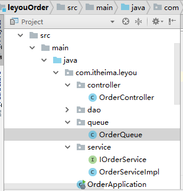


```java
@Component
public class OrderQueue {

    @Autowired
    private IOrderService iOrderService;

    @RabbitListener(queues = "order_queue")
    public void insertOrder(String msg){
        //1、接收消息并输出
        System.out.println("order_queue接收消息："+msg);

        //2、调用一个写入订单方法
        Map<String, Object> orderInfo = JSONObject.parseObject(msg, Map.class);
        Map<String, Object> resultMap = new HashMap<String, Object>();
        resultMap = iOrderService.insertOrder(orderInfo);

        //3、如果没写成功输出错误消息
        if (!(Boolean) resultMap.get("result")){
            System.out.println("order_queue处理消息失败：");
        }

        //4、成功输出消息
        System.out.println("order_queue处理消息成功！");
    }
}
```

### 4.6.9. 测试创建订单

先将session的判断挂起，user_id赋值为1。

在浏览器里输入 <http://localhost:4000/createOrder/26816294479>


队列也处理成功。

### 4.6.10. 创建查询订单方法（getOrder）

用途：查询订单详情，用于会员中心--我的订单查询

首先了解订单的表结构为：订单主表、订单明细表、订单物流状态表，一张订单有一个主表，多个明细，多个物流状态。

在OrderDao.java类中增加 getOrder方法，带一个orderid参数，意思是通过orderid进行查找，返回一个订单map，代码如下：

```java
public ArrayList<Map<String, Object>> getOrder(String order_id){
    String sql = "select d.sku_id, m.order_id, d.price " +
            "from tb_order m inner join tb_order_detail d on m.order_id = d.order_id " +
            "where m.order_id = ?";
    return (ArrayList<Map<String, Object>>) jdbcTemplate.queryForList(sql, order_id);
}
```


在StorageService.java类中增加getOrder方法，返回一个商品Map，代码如下：

```java
public Map<String, Object> getOrder(String order_id){
    Map<String, Object> resultMap = new HashMap<String, Object>();

    if (order_id==null||order_id.equals("")){
        resultMap.put("result", false);
        resultMap.put("msg", "参数传入有误！");
        return resultMap;
    }

    ArrayList<Map<String, Object>> list = iOrderDao.getOrder(order_id);
    resultMap.put("order", list);
    resultMap.put("result", true);
    resultMap.put("msg", "");
    return resultMap;
}
```

在StorageController.java类中增加getOrder方法，需要增加注解@RequestMapping，其中value = "/getOrder/{orderid}，返回一个商品Map，代码如下：

```java
@RequestMapping(value = "/getOrder/{order_id}")
public Map<String, Object> getOrder(@PathVariable("order_id") String order_id){
    return iOrderService.getOrder(order_id);
}
```

### 4.6.11. 创建更新订单状态方法（updateOrderStatus）

主要应用于队列更新订单状态的方法，在OrderDao.java中增加updateOrderStatus方法，代码如下：

```java
public boolean updateOrderStatus(String order_id){
    String sql = "update tb_order set status = 2 where order_id = ?";
    return jdbcTemplate.update(sql, order_id)==1;
}
```

### 4.6.12. 创建订单支付方法（payOrder）

主要用于前端支付页面调用，并写入订单状态更新队列

在OrderService.java中增加payOrder方法

```java
public Map<String, Object> payOrder(String order_id, String sku_id){
    Map<String, Object> resultMap = new HashMap<String, Object>();
    if (order_id==null||order_id.equals("")){
        resultMap.put("result", false);
        resultMap.put("msg", "订单有误！");
        return resultMap;
    }

    boolean result = iOrderDao.updateOrderStatus(order_id);

    if (!result){
        resultMap.put("result", false);
        resultMap.put("msg", "订单状态更新失败！");
        return resultMap;
    }

    amqpTemplate.convertAndSend("storage_queue", sku_id);

    resultMap.put("result", true);
    resultMap.put("msg", "");
    return resultMap;
}
```

在OrderController.java中增加payOrder方法

```java
@RequestMapping(value = "/payOrder/{order_id}/{sku_id}")
public Map<String, Object> payOrder(@PathVariable("order_id") String order_id, @PathVariable("sku_id") String sku_id){
    //正常情况下在这里会调用支付接口，我们这里模拟支付已经返回正常数据
    boolean isPay = true;
    Map<String, Object> resultMap = new HashMap<String, Object>();
    if (!isPay){
        resultMap.put("result", false);
        resultMap.put("msg", "支付接口调用失败！");
        return resultMap;
    }

    return iOrderService.payOrder(order_id, sku_id);
}
```


### 4.6.13. 测试查询订单

直接通过页面访问 getOrder 方法查询，http://localhost:4000/getOrder/1565019341112

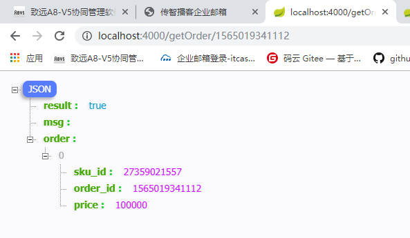


## 4.7. 创建网关服务（端口号80）

------

### 4.7.1. 创建网关服务

第一步：选择File-New-Module...，弹出的窗口中选择Spring initializr，选择Module SDK，选择Next

第二步：Group为com.itheima，Artifact为leyou，Name为ZuulServer，Description为Zuul For leyou Project，选择Next

第三步：选择 Spring Cloud Discovery，选择 Eureka Discovery Client，选择Next

第四步：Module name 为 ZuulServer，Content root为路径+ZuulServer，选择Finish，此时在项目文件夹下会创建一个 ZuulServer文件夹

### 4.7.2. 配置pom.xml

在生成的项目中，打开pom.xml，配置依赖，其中spring-cloud-starter-netflix-eureka-client为项目引入了Eureka客户端的jar包，spring-boot-starter-web引入了web场景下，web模块开发所用到的jar包

```xml
<?xml version="1.0" encoding="UTF-8"?>
<project xmlns="http://maven.apache.org/POM/4.0.0"
         xmlns:xsi="http://www.w3.org/2001/XMLSchema-instance"
         xsi:schemaLocation="http://maven.apache.org/POM/4.0.0 http://maven.apache.org/xsd/maven-4.0.0.xsd">
    <modelVersion>4.0.0</modelVersion>

    <parent>
        <groupId>org.springframework.boot</groupId>
        <artifactId>spring-boot-parent</artifactId>
        <version>2.1.6.RELEASE</version>
    </parent>

    <groupId>com.itheima</groupId>
    <artifactId>leyou</artifactId>
    <version>1.0-SNAPSHOT</version>

    <name>leyouZuul</name>

    <dependencies>
        <dependency>
            <groupId>org.springframework.cloud</groupId>
            <artifactId>spring-cloud-starter-netflix-zuul</artifactId>
        </dependency>

        <dependency>
            <groupId>org.springframework.cloud</groupId>
            <artifactId>spring-cloud-starter-netflix-hystrix</artifactId>
        </dependency>

        <dependency>
            <groupId>org.springframework.boot</groupId>
            <artifactId>spring-boot-starter-web</artifactId>
        </dependency>

        <dependency>
            <groupId>org.springframework.cloud</groupId>
            <artifactId>spring-cloud-starter-netflix-eureka-client</artifactId>
        </dependency>
    </dependencies>

    <dependencyManagement>
        <dependencies>
            <dependency>
                <groupId>org.springframework.cloud</groupId>
                <artifactId>spring-cloud-dependencies</artifactId>
                <version>Greenwich.SR2</version>
                <type>pom</type>
                <scope>import</scope>
            </dependency>
        </dependencies>
    </dependencyManagement>
</project>
```


### 4.7.3. 配置文件application.properties

在生成的项目中，打开src\man\resources\application.properties，配置端口号等

```properties
server.port=80
spring.application.name=leyou-zuul
eureka.client.service-url.defaultZone=http://localhost:9000/eureka/


#忽略框架默认的服务映射路径
zuul.ignored-services='*'
#不忽略框架与权限相关的头信息
zuul.ignore-security-headers=false

zuul.host.socket-timeout-millis=60000
zuul.host.connect-timeout-millis=60000

zuul.host.max-total-connections=500

zuul.routes.leyou-client.path=/leyouClient/**
zuul.routes.leyou-client.serviceId=leyou-client
#防止session不一致问题
zuul.routes.leyou-client.sensitiveHeaders="*"

zuul.routes.leyou-order.path=/leyouOrder/**
zuul.routes.leyou-order.serviceId=leyou-order
zuul.routes.leyou-order.sensitiveHeaders="*"

zuul.routes.leyou-user.path=/leyouUser/**
zuul.routes.leyou-user.serviceId=leyou-user
zuul.routes.leyou-user.sensitiveHeaders="*"

zuul.routes.leyou-stock.path=/leyouStock/**
zuul.routes.leyou-stock.serviceId=leyou-stock
zuul.routes.leyou-stock.sensitiveHeaders="*"

zuul.routes.leyou-storage.path=/leyouStorage/**
zuul.routes.leyou-storage.serviceId=leyou-storage
zuul.routes.leyou-storage.sensitiveHeaders="*"

zuul.routes.leyou-time-server.path=/leyouTimeServer/**
zuul.routes.leyou-time-server.serviceId=leyou-time-server
zuul.routes.leyou-time-server.sensitiveHeaders="*"
```

zuul.routes.leyou-order.path为每个服务的路径

zuul.routes.leyou-stock.serviceId为每个服务的编号

以此类推，将所有服务进行配置

**注意：zuul使用80端口，在访问的时候可以不用输入端口号。**

在生成的项目中，打开src\main\java\com.itheima.leyou\leyouTimeServerApplication，在已经生成的启动类中加入 @EnableZuulProxy，当Zuul与Eureka、Ribbon等组件配合使用时，我们使用@EnableZuulProxy

```java
@SpringBootApplication
@EnableZuulProxy
public class ZuulApplication {

   public static void main(String[] args) {
      SpringApplication.run(ZuulApplication.class, args);
   }

}
```

测试运行网关服务，利用前面的查询库存的方法：getStockStorage

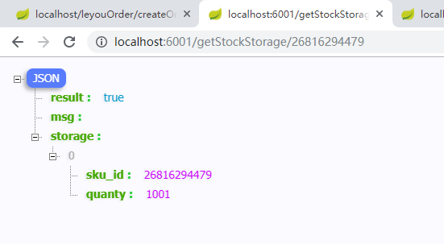

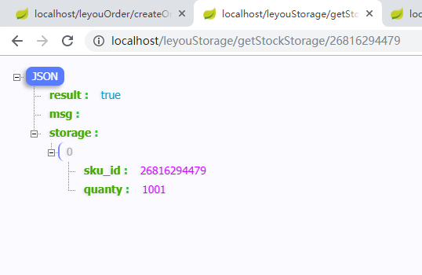

将原来的 <http://localhost:6001/getStockStorage/26816294479>

改为<http://localhost/leyouStorage/getStockStorage/26816294479>

## 4.8. 创建页面服务（端口号3000）

------

### 4.8.1. 创建页面服务

第一步：选择File-New-Module...，弹出的窗口中选择Spring initializr，选择Module SDK，选择Next


第二步：Group为com.itheima，Artifact为leyou，Name为leyouClient，Description为Client For leyou Project，选择Next


第三步：选择 Web，选择 Spring Web Starter，选择Next

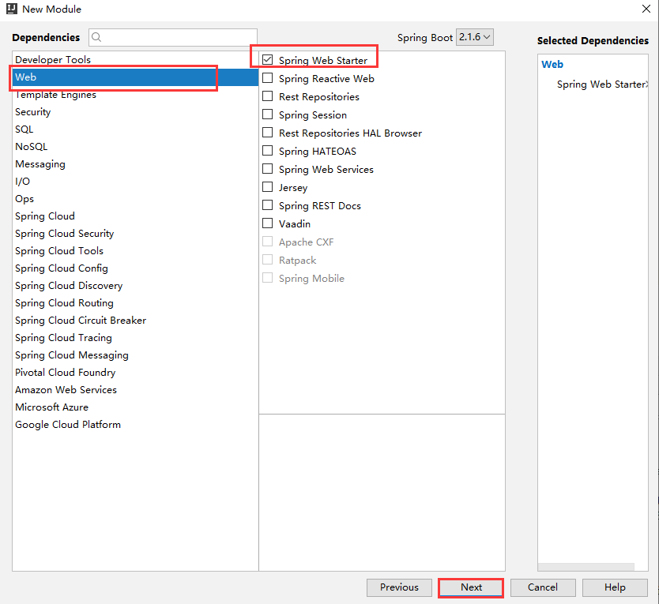

第四步：Module name 为 leyouClient，Content root为路径+leyouClient，选择Finish，此时在项目文件夹下会创建一个 leyouClient文件夹

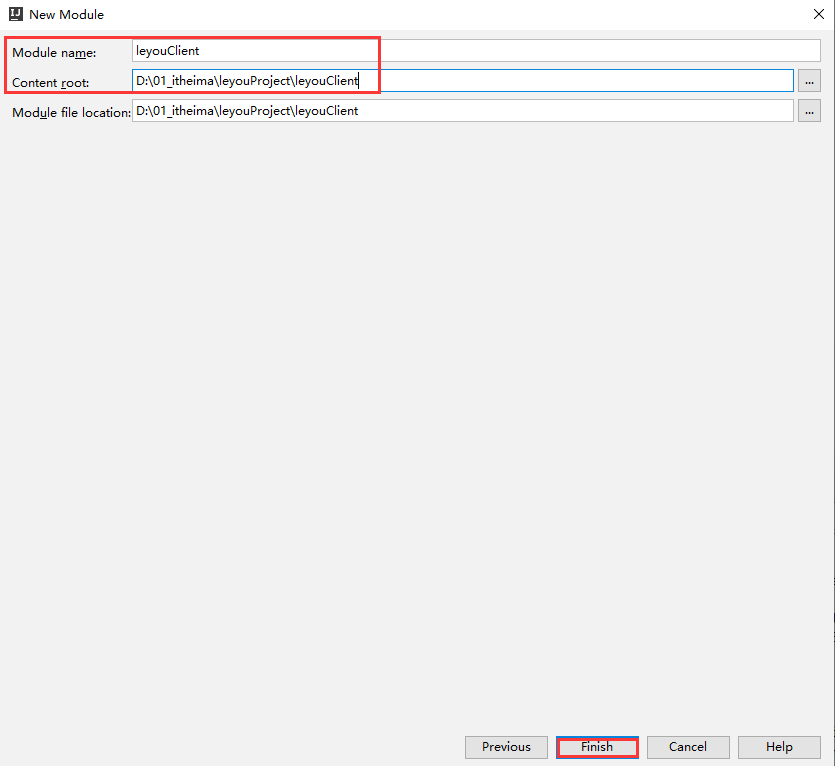

### 4.8.2. 配置pom.xml

在生成的项目中，打开pom.xml，配置依赖，其中spring-cloud-starter-netflix-eureka-client为项目引入了Eureka客户端的jar包，spring-boot-starter-web引入了web场景下，web模块开发所用到的jar包

```xml
<?xml version="1.0" encoding="UTF-8"?>
<project xmlns="http://maven.apache.org/POM/4.0.0"
         xmlns:xsi="http://www.w3.org/2001/XMLSchema-instance"
         xsi:schemaLocation="http://maven.apache.org/POM/4.0.0 http://maven.apache.org/xsd/maven-4.0.0.xsd">
    <modelVersion>4.0.0</modelVersion>

    <parent>
        <groupId>org.springframework.boot</groupId>
        <artifactId>spring-boot-parent</artifactId>
        <version>2.1.6.RELEASE</version>
    </parent>

    <groupId>com.itheima</groupId>
    <artifactId>leyou</artifactId>
    <version>1.0-SNAPSHOT</version>

    <name>leyouClient</name>

    <dependencies>
        <dependency>
            <groupId>org.springframework.cloud</groupId>
            <artifactId>spring-cloud-starter-netflix-eureka-client</artifactId>
        </dependency>

        <dependency>
            <groupId>org.springframework.boot</groupId>
            <artifactId>spring-boot-starter-web</artifactId>
        </dependency>
    </dependencies>

    <dependencyManagement>
        <dependencies>
            <dependency>
                <groupId>org.springframework.cloud</groupId>
                <artifactId>spring-cloud-dependencies</artifactId>
                <version>Greenwich.SR2</version>
                <type>pom</type>
                <scope>import</scope>
            </dependency>
        </dependencies>
    </dependencyManagement>
    
</project>
```

在pom.xml中的build标签中必须加入以下资源包，否则访问页面会报404，原因是SpringBoot必须先指定路径，然后编译成功再启动，才可以访问页面

```xml
<build>
   <plugins>
      <plugin>
         <groupId>org.springframework.boot</groupId>
         <artifactId>spring-boot-maven-plugin</artifactId>
      </plugin>
   </plugins>

   <!-- 必须引入以下资源包才可以解决 jsp404 的问题 -->
   <resources>
      <resource>
         <directory>src/main/java</directory>
         <includes>
            <include>**/*.xml</include>
         </includes>
      </resource>
      <resource>
         <directory>src/main/resources</directory>
         <includes>
            <include>**/*.*</include>
         </includes>
      </resource>
      
      <resource>
         <!-- 指定resources插件处理哪个目录下的资源文件 -->
         <directory>src/main/webapp</directory>
         <!--注意此次必须要放在此目录下才能被访问到 -->
         <targetPath>resources</targetPath>
         <includes>
            <include>**/*.*</include>
         </includes>
      </resource>
   </resources>
   <!-- 解决 jsp404 -->
</build>
```


### 4.8.3. 配置文件application.properties

在生成的项目中，打开src\man\resources\application.properties，配置端口号等

```properties
server.port=3000
spring.application.name=leyou-client
eureka.client.service-url.defaultZone=http://localhost:9000/eureka/
```

在生成的项目中，打开src\main\java\com.itheima.leyou\leyouClientApplication，在已经生成的启动类中加入 @EnableEurekaClient，意思为启动Eureka客户端

```java
@SpringBootApplication
@EnableEurekaClient
public class ClientApplication {

   public static void main(String[] args) {
      SpringApplication.run(ClientApplication.class, args);
   }

}
```

测试运行页面服务，在Eureka注册中心中可以看到 leyou-client服务，证明服务启动成功

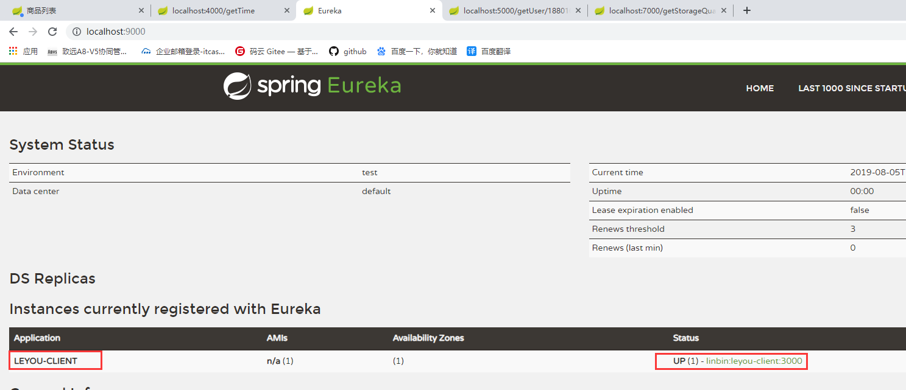

### 4.8.4. 创建页面文件夹

1、 在main下创建webapp文件夹

2、在webapp文件夹下创建page文件夹，用来存放html页面文件

3、在webapp文件夹下创建resources文件夹，用来存入引入的插件，这里用到的是bootstrap和jquery，bootstrap主要是页面的样式，jquery主要是使用ajax与后台交互。

### 4.8.5. 引入bootstrap

将bootstrap-4.3.1-dist文件夹复制到resources文件夹下

将jquery文件夹复制到resources文件夹下

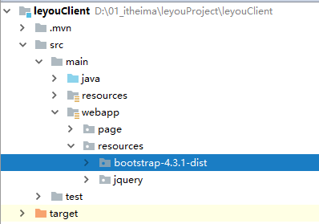

### 4.8.6. 创建会员登录页面（loginPage.html）

用途：用于会员注册、会员登录

将loginPage.html复制到 main\webapp\page\文件夹下

### 4.8.7. 创建商品列表页面（stockListPage.html）

用途：用于展示商品列表

将stockListPage.html复制到 main\webapp\page\文件夹下

### 4.8.8. 创建商品详情页面（stockDetailPage.html）

用途：用于展示商品详情

将stockDetailPage.html复制到 main\webapp\page\文件夹下

### 4.8.9. 创建订单页面（createOrderPage.html）

用途：用于提交订单

将createOrderPage.html复制到 main\webapp\page\文件夹下

### 4.8.8. 创建支付页面（payPage.html）

用途：用于支付订单

将payPage.html复制到 main\webapp\page\文件夹下

### 4.8.8. 创建秒杀政策页面（limitPolicyPage.html）

用途：用于秒杀政策添加

将limitPolicyPage.html复制到 main\webapp\page\文件夹下

## 4.9. 创建配置服务（端口号2000）

------

### 4.9.1 创建配置服务

第一步：选择File-New-Module...，弹出的窗口中选择Spring initializr，选择Module SDK，选择Next


第二步：Group为com.itheima，Artifact为leyou，Name为leyouClient，Description为Client For leyou Project，选择Next

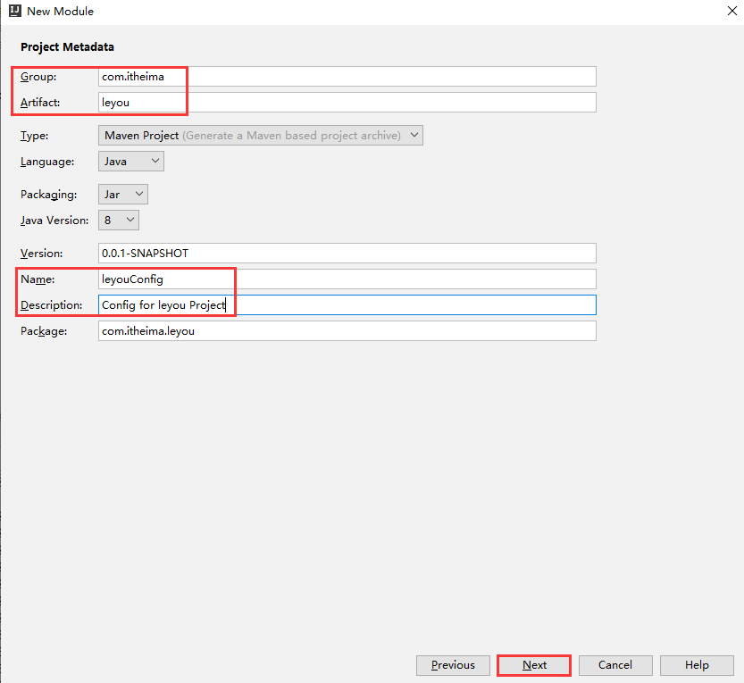

第三步：选择 Spring Cloud Discovery，选择 Eureka Discovery Client，选择Next

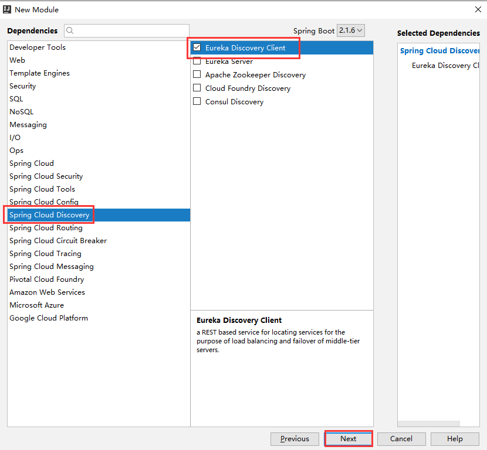

第四步：Module name 为 leyouConfig，Content root为路径+leyouConfig，选择Finish，此时在项目文件夹下会创建一个 leyouConfig文件夹

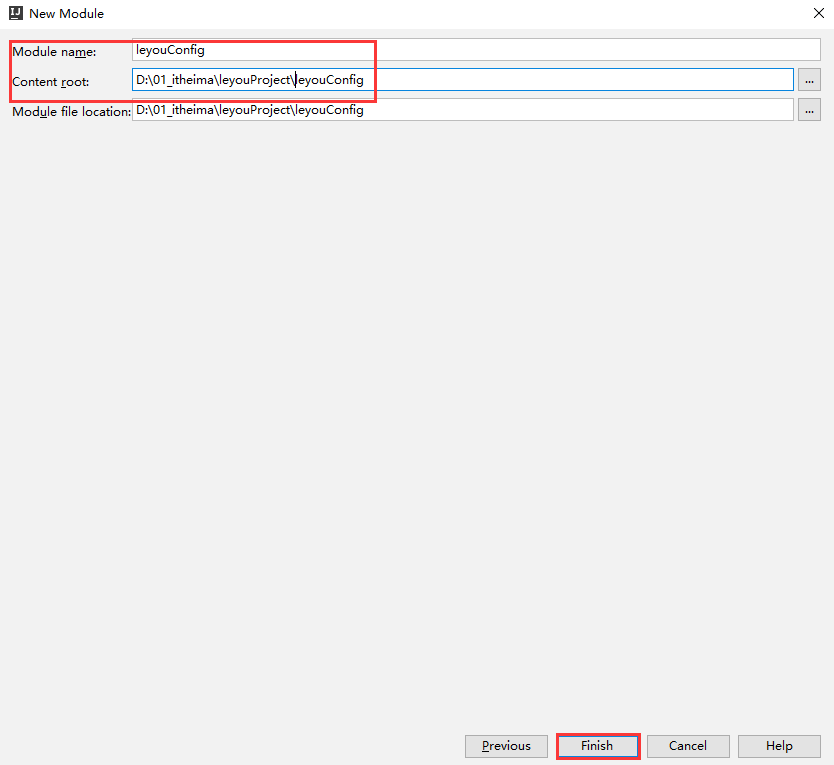

### 4.9.2. ConfigServer配置

在生成的项目中，打开pom.xml，配置依赖，其中spring-cloud-starter-netflix-eureka-client为项目引入了Eureka客户端的jar包，spring-boot-starter-web引入了web场景下，web模块开发所用到的jar包，spring-cloud-config-server引入了配置服务器所用到的jar包

```xml
<?xml version="1.0" encoding="UTF-8"?>
<project xmlns="http://maven.apache.org/POM/4.0.0"
         xmlns:xsi="http://www.w3.org/2001/XMLSchema-instance"
         xsi:schemaLocation="http://maven.apache.org/POM/4.0.0 http://maven.apache.org/xsd/maven-4.0.0.xsd">
    <modelVersion>4.0.0</modelVersion>

    <parent>
        <groupId>org.springframework.boot</groupId>
        <artifactId>spring-boot-parent</artifactId>
        <version>2.1.6.RELEASE</version>
    </parent>

    <groupId>com.itheima</groupId>
    <artifactId>leyou</artifactId>
    <version>1.0-SNAPSHOT</version>

    <name>leyouConfig</name>

    <dependencies>
        <dependency>
            <groupId>org.springframework.cloud</groupId>
            <artifactId>spring-cloud-starter-netflix-eureka-client</artifactId>
        </dependency>

        <dependency>
            <groupId>org.springframework.boot</groupId>
            <artifactId>spring-boot-starter-web</artifactId>
        </dependency>
        <dependency>
            <groupId>org.springframework.cloud</groupId>
            <artifactId>spring-cloud-config-server</artifactId>
        </dependency>
    </dependencies>

    <dependencyManagement>
        <dependencies>
            <dependency>
                <groupId>org.springframework.cloud</groupId>
                <artifactId>spring-cloud-dependencies</artifactId>
                <version>Greenwich.SR2</version>
                <type>pom</type>
                <scope>import</scope>
            </dependency>
        </dependencies>
    </dependencyManagement>
    
</project>
```


在src\man\resources文件夹下新增shared文件夹，用于存放各个服务的配置文件

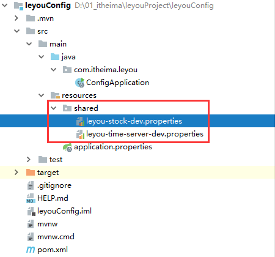

### 4.9.3. 配置文件application.properties

在生成的项目中，打开src\man\resources\application.properties，配置端口号等

```properties
server.port=2000
spring.application.name=leyou-config-server
eureka.client.service-url.defaultZone=http://localhost:9000/eureka/
spring.cloud.config.server.native.search-locations=classPath:/shared
spring.cloud.config.profile=dev
spring.profiles.active=native
```

在src\man\resources下新建一个shared文件夹

**注意：在application.properties中spring.cloud.config.server.native.search-locations这一项指的是查找本地文件路径，指向shared中，实际项目中大部分软件公司这一项可能在某台服务器上或者远程仓库。**

**share文件夹里文件的命名规则为：各个服务配置文件中spring.application.name+配置服务的application.properties文件中的spring.cloud.config.profile值的内容。**

**例如：leyou-time-server是时间服务（leyouTimeServer）的spring.application.name，配置服务的application.properties文件中的spring.cloud.config.profile为dev，所以对于商品服务的配置文件名字是 leyou-time-server-dev.properties**

leyou-time-server-dev.properties配置内容：

```properties
server.port=8000
spring.application.name=leyou-time-server
eureka.client.service-url.defaultZone=http://localhost:9000/eureka/

```

在生成的项目中，打开src\main\java\com.itheima.leyou\leyouConfigApplication，在已经生成的启动类中加入 @EnableEurekaClient，意思为启动Eureka客户端，并加入@EnableConfigServer，意思为启动Config配置服务

```java
@SpringBootApplication
@EnableEurekaClient
@EnableConfigServer
public class ConfigApplication {

   public static void main(String[] args) {
      SpringApplication.run(ConfigApplication.class, args);
   }

}
```

以商品服务为例：

时间服务增加依赖

```xml
<dependency>
    <groupId>org.springframework.cloud</groupId>
    <artifactId>spring-cloud-config-client</artifactId>
</dependency>
```

将原商品服务配置文件main/resources/application.properties里的内容挂起，新建一个bootstrap.properties文件，代码如下：

```properties
spring.application.name=leyou-time-server
spring.cloud.config.profile=dev
spring.cloud.config.uri=http://localhost:2000
spring.cloud.config.label=master
spring.profiles.active=dev
```

测试运行配置服务和商品服务，在Eureka注册中心中可以看到 leyou-config-server以及leyou-stock服务，证明服务配置成功

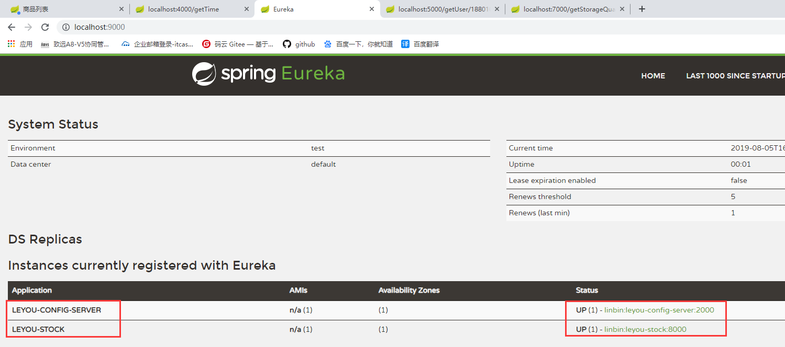

### 4.9.4. 优先找配置文件原则

修改时间服务（leyouTimeServer）的application.properties配置文件

```properties
server.port=8001
spring.application.name=leyou-time-server
eureka.client.service-url.defaultZone=http://localhost:9000/eureka/
```

**注意：这里端口号改成8001**

启动配置服务，再启动时间服务，控制台可以看到启动的是**8000**

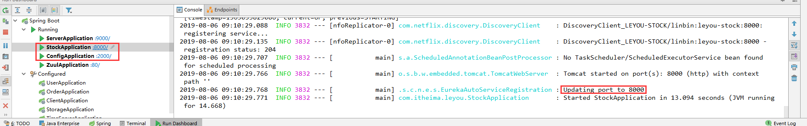

不启动配置服务，再启动时间服务，控制台可以看到启动的是**8001**

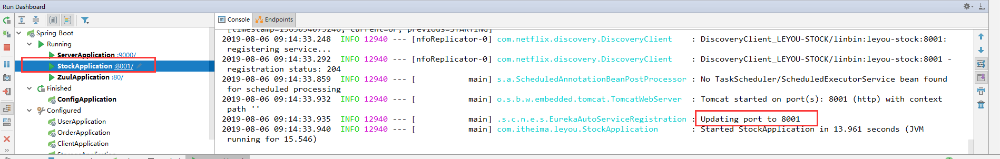

结论：服务启动时，优先找bootstrap.properties，如果找不到，再找application.properties，证明bootstrap比application的优先级要高。

# 五、项目测试

## 5.1. 新建秒杀政策

地址：<http://localhost/leyouClient/page/limitPolicyPage.html>


选择商品，输入秒杀价格、秒杀库存、开始时间、结束时间，点保存。


## 5.2. 登录页面

地址：http://localhost/leyouClient/page/loginPage.html


## 5.3. 商品列表页

在登录页中输入手机号，密码，跳转商品列表页

地址：<http://localhost/leyouClient/page/stockListPage.html>


## 5.4. 商品详情页

在商品列表页中选择一个商品

地址：<http://localhost/leyouClient/page/stockDetailPage.html?sku_id=27359021557>


## 5.5. 提交订单

在商品详情页中点击【立即抢购】

地址：<http://localhost/leyouClient/page/createOrderPage.html?sku_id=27359021557>


## 5.6. 付款页面

在提交订单页面点击【提交订单】

地址：<http://localhost/leyouClient/page/payPage.html?order_id=1565061554849>


点击【微信支付】，提示“支付成功”


关于队列

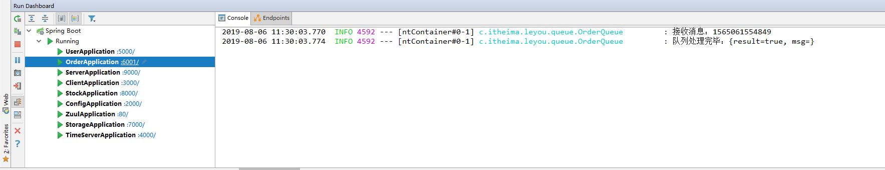

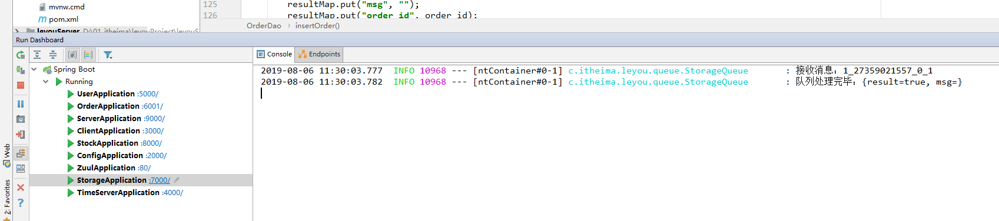


# 六、关于面试

## 6.1. 以前做过什么项目？

答：商城项目、商城秒杀系统，整个商城项目中秒杀是其中最关键的一个营销活动，所以独立出来成为一个系统。秒杀系统就是我主做的。

## 6.2. 项目上线了吗？外网能否访问？

答：已经上线了，但是我们是外包公司，项目开发完之后布署到哪里不太清楚，所以不知道如何访问。

## 6.3. 项目收益是多少？

答：由于是开发人员，收益这一块都是产品那边在管，所以对于开发人员来说这个不太清楚


## 6.4. 项目团队中有多少人？怎样分工？

答：团队中有10个人，1个设计师，6个java开发，1个前端，2个测试。我在6人的开发团队中负责整体架构及部分代码，一般都是设计师写好概要设计，其中包含需求调研说明，项目背景，操作流程，使用技术架构，架构图。我们开发再完善详细设计，其中包含表结构，每个微服务能处理的业务，甚至还会写一些伪代码。前端负责页面开发，我们开发出来的版本交给测试人员进行测试，最终交付。

## 6.5. 项目中遇到了什么样的问题？是怎么解决的？

答：

1、技术架构方面：刚开始的时候本来使用的是数据库来控制超买超卖，但是效率上有很大的问题，因为我们在压力测试的时候，数据库会造成很多死锁，前端页面就会没有响应。后来我们采用了redis缓存技术来解决超买超卖的问题，将秒杀的商品及库存全部存到redis里，然后秒杀一个减一个，都在缓存里处理，这样就有效的解决了效率问题。

2、开发方面：我在开发库存那一块代码的时候，库存总是减不成功，于是我先查看控制台日志，看是否有报错，然后分析，最后打断点，一行一行跟踪代码找到问题。

3、与前端的交互方面：我们提供的接口，前端那边接收到的数据解析不出来，这就需要我们输出一下我们提供接口返回的数据，看是否是有乱码，或者格式不对，字段不对等问题，也需要和前端一起联调。

4、测试方面：测试人员在提供测试报告之后，有一些问题很难重现，首先需要用他们的数据进行模拟，看是否是数据问题，其次是用他们的环境进行跟踪代码，看能否找到问题。

## 6.6. 分布式事务是如何处理的？

答：分布式事务是通过 TCC 模式进行处理，比如订单和库存服务，订单服务和库存服务在开启事务之后先是执行 try 的逻辑，大家都没问题了，订单服务执行业务代码，然后执行confirm的逻辑，库存也执行业务代码，然后执行comfirm的逻辑，大家一起提交。如果库存服务 try 的逻辑执行失败时，会通知订单服务执行 cancel 的逻辑。

在大家都没问题的情况下，try要进行一次交互，然后 confirm 再进行一次交互，所以协调完两个服务会有成本。量小的时候没问题，但是量一旦很大的时候，这样就会造成排队现象。

所以我们没有使用分布式事务处理多个微服务之间的事务问题，我们先是通过redis来处理前端的请求，然后把业务进行拆分，拆分的业务使用消息队列中间件来解决，每个服务都开启自己的事务处理业务，这样可以更加高效的解决并发。

## 6.7. 项目开发用了多久？

答：前期的调研加概要设计大概用了10天，我们补充详细设计大概是5天，开发用时在20天左右的时间，加上测试，联调，解决bug，复测，上线应该在1个半月左右。

## 6.8. 项目中用到了哪些技术？

答：用的是SpringCloud微服务架构，主要解决后台服务压力过大的问题，所以根据不同模块进行拆分，每个开发小组负责一个微服务，缓存用的redis中间件，处理业务拆分用到的是RabbitMQ。

## 6.9. 项目中的数据都是通过SQL查询的吗？

答：不完全是，比如商品取到的秒杀政策就是在redis里取的，不是通过SQL查询，而商品列表和商品详情都是通过SQL查询的。还有控制秒杀的数量都是在redis里进行控制的，而不是实时用SQL查询库存。

## 6.10. 项目中你觉得哪个模块最难？

答：处理业务模块上我觉得库存模块最难，由于库存是敏感数据，操作都要非常谨慎，一旦库存出错，会给商家带来具大的损失。

如何处理大并发量是这个项目的难点，我们是通过redis控制超买超卖，通过消息队列RabbitMQ来对业务进行拆分。


